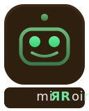

<p align="center">
  
</p>

# mirroir-mcp

[](https://www.npmjs.com/package/mirroir-mcp)
[](https://github.com/jfarcand/mirroir-mcp/actions/workflows/build.yml)
[](https://github.com/jfarcand/mirroir-mcp/actions/workflows/install.yml)
[](https://github.com/jfarcand/mirroir-mcp/actions/workflows/installers.yml)
[](https://github.com/jfarcand/mirroir-mcp/actions/workflows/mcp-compliance.yml)
[](LICENSE)
[](https://support.apple.com/en-us/105071)

## What's Changed

"Scenario" is now "skill" everywhere: MCP tools (`list_skills`, `get_skill`), parameters (`skill_name`), directories (`.mirroir-mcp/skills/`), and the community repo ([mirroir-skills](https://github.com/jfarcand/mirroir-skills)). The old `list_scenarios` / `get_scenario` tools no longer exist — update your client config and any scripts that reference them.

---

We built an MCP server to control iPhones through macOS iPhone Mirroring — then realized the same tools work on any macOS window. [Screenshot, tap, swipe, type, scroll_to, measure](docs/tools.md) — from any MCP client. Same security model. Same skills. Same AI. No source code required.

When automation breaks — a button moves, a label changes, timing drifts — [Agent Diagnosis](#agent-diagnosis) tells you *why* and how to fix it. Self-diagnosing automation, not just self-running.

Input flows through [Karabiner DriverKit](https://github.com/pqrs-org/Karabiner-DriverKit-VirtualHIDDevice) virtual HID devices because iPhone Mirroring blocks standard CGEvent injection. The installer uses the standalone DriverKit package (no keyboard grabber, no modifier corruption). Existing Karabiner-Elements installs are detected and reused automatically.

## Requirements

- macOS 15+
- iPhone connected via [iPhone Mirroring](https://support.apple.com/en-us/105071)

## Install

```bash
/bin/bash -c "$(curl -fsSL https://mirroir.dev/get-mirroir.sh)"
```

or via [npx](https://www.npmjs.com/package/mirroir-mcp):

```bash
npx -y mirroir-mcp install
```

or via [Homebrew](https://tap.mirroir.dev):

```bash
brew tap jfarcand/tap && brew install mirroir-mcp
```

After install, approve the DriverKit system extension if prompted: **System Settings > General > Login Items & Extensions**. If you have Karabiner-Elements, enable all its toggles. If you installed the standalone DriverKit package, enable the Karabiner-DriverKit-VirtualHIDDevice toggle. The first time you take a screenshot, macOS will prompt for **Screen Recording** and **Accessibility** permissions. Grant both.

<details>
<summary>Per-client setup</summary>

#### Claude Code

```bash
claude mcp add --transport stdio mirroir -- npx -y mirroir-mcp
```

#### GitHub Copilot (VS Code)

Install from the MCP server gallery: search `@mcp mirroir` in the Extensions view, or add to `.vscode/mcp.json`:

```json
{
  "servers": {
    "mirroir": {
      "type": "stdio",
      "command": "npx",
      "args": ["-y", "mirroir-mcp"]
    }
  }
}
```

#### Cursor

Add to `.cursor/mcp.json` in your project root:

```json
{
  "mcpServers": {
    "mirroir": {
      "command": "npx",
      "args": ["-y", "mirroir-mcp"]
    }
  }
}
```

#### OpenAI Codex

```bash
codex mcp add mirroir -- npx -y mirroir-mcp
```

Or add to `~/.codex/config.toml`:

```toml
[mcp_servers.mirroir]
command = "npx"
args = ["-y", "mirroir-mcp"]
```

#### Helper daemon only

If your MCP client is already configured but the helper daemon isn't running:

```bash
npx mirroir-mcp setup
```

</details>

<details>
<summary>Install from source</summary>

```bash
git clone https://github.com/jfarcand/mirroir-mcp.git
cd mirroir-mcp
./mirroir.sh
```

The installer handles everything: installs the standalone DriverKit package if no virtual HID is available (or reuses existing Karabiner-Elements), waits for extension approval, builds both binaries, configures the Karabiner ignore rule when needed, installs the helper daemon, and runs a verification check. Use the full path to the binary in your `.mcp.json`: `<repo>/.build/release/mirroir-mcp`.

</details>

## Examples

Paste any of these into Claude Code, Claude Desktop, ChatGPT, Cursor, or any MCP client:

**Send an iMessage:**

```
Open Messages, find my conversation with Alice, and send "running 10 min late".
Take a screenshot so I can confirm it was sent.
```

**Add a calendar event:**

```
Open Calendar, create a new event called "Dentist" next Tuesday at 2pm,
and screenshot the week view so I can see it.
```

**Test a login flow:**

```
Open my Expo Go app, tap on the "LoginDemo" project, and test the login
screen. Use test@example.com / password123. Take a screenshot after each step
so I can see what happened.
```

**Record a bug repro video:**

```
Start recording, open Settings, scroll down to General > About, then stop
recording. I need a video of the scroll lag I'm seeing.
```

> **Tip:** `describe_screen` supports `skip_ocr: true` to return only the grid-overlaid screenshot without running Vision OCR, letting the MCP client use its own vision model instead (costs more tokens but can identify icons, images, and non-text UI elements).

## Agent Diagnosis

UI automation is brittle. A button moves, a label changes, timing drifts, and your test silently fails. You stare at screenshots trying to figure out what went wrong. `--agent` fixes this: when a compiled skill fails, it diagnoses *why* the step failed and tells you exactly how to fix it.

Diagnosis runs in two tiers. First, deterministic OCR analysis compares the compiled coordinates against what's actually on screen — fast, free, no API key needed. If you pass a model name, it sends the diagnostic context (expected vs. actual OCR, failure screenshots, step metadata) to an AI for richer analysis: root cause, suggested YAML edits, and whether recompilation will fix it.

```bash
mirroir test --agent skill.yaml                    # deterministic OCR diagnosis
mirroir test --agent claude-sonnet-4-6 skill.yaml  # deterministic + AI via Anthropic
mirroir test --agent gpt-4o skill.yaml             # deterministic + AI via OpenAI
mirroir test --agent ollama:llama3 skill.yaml      # deterministic + AI via local Ollama
mirroir test --agent copilot skill.yaml            # deterministic + AI via Copilot CLI
```

**Built-in models:** `claude-sonnet-4-6`, `claude-haiku-4-5`, `gpt-4o`. Set the corresponding API key env var (`ANTHROPIC_API_KEY`, `OPENAI_API_KEY`).

**Custom agents:** Place a YAML profile in `~/.mirroir-mcp/agents/` (global) or `<cwd>/.mirroir-mcp/agents/` (project-local, takes priority). Two modes:

```yaml
# API mode — call a cloud provider
name: my-agent
mode: api
provider: anthropic
model: claude-sonnet-4-6-20250514
api_key_env: MY_KEY
```

```yaml
# Command mode — run a local CLI
name: my-agent
mode: command
command: copilot
args: ["-p", "Analyze: ${PAYLOAD}"]
```

Command mode supports `${PAYLOAD}` substitution in args for CLIs that take prompts as arguments (like `claude --print -p` or `copilot -p`). Without `${PAYLOAD}`, the diagnostic JSON is piped to stdin.

The system prompt is loaded from `~/.mirroir-mcp/prompts/diagnosis.md` (or `<cwd>/.mirroir-mcp/prompts/diagnosis.md`, project-local takes priority) — edit it to customize AI behavior. The default prompt is installed from the repo-level `prompts/` directory.

All AI errors are non-fatal: deterministic diagnosis always runs regardless.

## Skills

Skills describe multi-step automation flows as intents, not scripts. Steps like `tap: "Email"` don't specify coordinates — the AI finds the element by fuzzy OCR matching and adapts to unexpected dialogs, screen layout changes, and timing.

Two formats are supported: **SKILL.md** (recommended) and **YAML** (legacy). SKILL.md uses YAML front matter for metadata and natural-language markdown for steps — the format AI agents natively understand. When both `foo.md` and `foo.yaml` exist, the `.md` file takes precedence.

**SKILL.md format** — natural-language steps the AI reads and executes directly:

```markdown
---
version: 1
name: Commute ETA Notification
app: Waze, Messages
ios_min: "17.0"
locale: "fr_CA"
tags: ["workflow", "cross-app", "waze", "messages"]
---

Get commute ETA from Waze, then send it via iMessage.

## Steps

1. Launch **Waze**
2. Wait for "Où va-t-on ?" to appear
3. Tap "Où va-t-on ?"
4. Wait for "${DESTINATION:-Travail}" to appear
5. Tap "${DESTINATION:-Travail}"
6. Wait for "Y aller" to appear
7. Tap "Y aller"
8. Wait for "min" to appear
9. Remember: Read the commute time and ETA from the navigation screen.
10. Press Home
11. Launch **Messages**
12. Wait for "Messages" to appear
13. Tap "New Message"
14. Wait for "À :" to appear
15. Tap "À :"
16. Type "${RECIPIENT}"
17. Wait for "${RECIPIENT}" to appear
18. Tap "${RECIPIENT}"
19. Wait for "iMessage" to appear
20. Tap "iMessage"
21. Type "${MESSAGE_PREFIX:-On my way!} {commute_time} to the office (ETA {eta})"
22. Press **Return**
23. Wait for "Distribué" to appear
24. Screenshot: "message_sent"
```

<details>
<summary>Equivalent YAML format</summary>

```yaml
name: Commute ETA Notification
app: Waze, Messages
description: Get commute ETA from Waze, then send it via iMessage.

steps:
  - launch: "Waze"
  - wait_for: "Où va-t-on ?"
  - tap: "Où va-t-on ?"
  - wait_for: "${DESTINATION:-Travail}"
  - tap: "${DESTINATION:-Travail}"
  - wait_for: "Y aller"
  - tap: "Y aller"
  - wait_for: "min"
  - remember: "Read the commute time and ETA from the navigation screen."
  - press_home: true
  - launch: "Messages"
  - wait_for: "Messages"
  - tap: "New Message"
  - wait_for: "À :"
  - tap: "À :"
  - type: "${RECIPIENT}"
  - wait_for: "${RECIPIENT}"
  - tap: "${RECIPIENT}"
  - wait_for: "iMessage"
  - tap: "iMessage"
  - type: "${MESSAGE_PREFIX:-On my way!} {commute_time} to the office (ETA {eta})"
  - press_key: "return"
  - wait_for: "Distribué"
  - screenshot: "message_sent"
```

</details>

`${VAR}` placeholders are resolved from environment variables. Use `${VAR:-default}` for fallback values. Place skills (`.md` or `.yaml`) in `~/.mirroir-mcp/skills/` (global) or `<cwd>/.mirroir-mcp/skills/` (project-local). Both directories are scanned recursively.

### Migrate YAML to SKILL.md

Convert existing YAML skills to the SKILL.md format:

```bash
mirroir migrate apps/settings/check-about.yaml           # single file
mirroir migrate --dir ~/.mirroir-mcp/skills               # entire directory
mirroir migrate --output-dir ./converted/ skill.yaml      # write .md files to alternate directory
mirroir migrate --dry-run apps/mail/email-triage.yaml     # preview without writing
```

### Skill Marketplace

Ready-to-use skills that automate anything a human can do on an iPhone — tap, type, navigate, chain apps together. If you can do it manually, you can script it. Install from [jfarcand/mirroir-skills](https://github.com/jfarcand/mirroir-skills):

#### Claude Code

```bash
claude plugin marketplace add jfarcand/mirroir-skills
claude plugin install skills@mirroir-skills
```

#### GitHub Copilot CLI

```bash
copilot plugin marketplace add jfarcand/mirroir-skills
copilot plugin install skills@mirroir-skills
```

#### Manual (all other clients)

```bash
git clone https://github.com/jfarcand/mirroir-skills ~/.mirroir-mcp/skills
```

Once installed, skills are available through the `list_skills` and `get_skill` tools. Claude Code and Copilot CLI load the [SKILL.md](https://github.com/jfarcand/mirroir-skills/blob/main/plugins/skills/skills/skills/SKILL.md) automatically, which teaches the AI how to interpret and execute each step type. For other clients, ask the AI to call `list_skills` and then execute the steps.

See [Tools Reference](docs/tools.md#skills) for the full step type reference and directory layout.

## Test Runner

Run skills deterministically from the command line — no AI in the loop. Steps execute sequentially: OCR finds elements, taps land on coordinates, assertions pass or fail. Designed for CI, regression testing, and scripted automation.

```bash
mirroir test [options] <skill>...
```

**Run a skill:**

```bash
mirroir test apps/settings/check-about
```

**Run all skills with JUnit output:**

```bash
mirroir test --junit results.xml --verbose
```

**Validate skills without executing (dry run):**

```bash
mirroir test --dry-run apps/settings/*.yaml
```

| Option | Description |
|---|---|
| `--junit <path>` | Write JUnit XML report (for CI integration) |
| `--screenshot-dir <dir>` | Save failure screenshots (default: `./mirroir-test-results/`) |
| `--timeout <seconds>` | `wait_for` timeout (default: 15) |
| `--verbose` | Show step-by-step detail |
| `--dry-run` | Parse and validate without executing |
| `--no-compiled` | Skip compiled skills, force full OCR |
| `--agent [model]` | Diagnose compiled failures (see [Agent Diagnosis](#agent-diagnosis)) |

The test runner uses the same OCR and input subsystems as the MCP server. Steps like `tap: "General"` find the element via Vision OCR and tap at the detected coordinates. `wait_for` polls OCR until the label appears or times out. AI-only steps (`remember`, `condition`, `repeat`) are skipped with a warning.

The test runner executes YAML skills only — SKILL.md files contain natural-language steps that require AI interpretation and cannot be run deterministically. When resolving by name (e.g., `mirroir test check-about`), only `.yaml` files are matched. Pass a direct `.yaml` path to run a specific file. Skill resolution searches `<cwd>/.mirroir-mcp/skills/` and `~/.mirroir-mcp/skills/` — same directories as `list_skills`.

Exit code is `0` when all skills pass, `1` when any step fails.

### Compiled Skills

Compile a skill once against a real device to capture coordinates, timing, and scroll counts. Replay with zero OCR — pure input injection plus timing. Like JIT compilation for UI automation.

**AI auto-compilation (recommended):** When an AI agent executes a skill via MCP tools, it auto-compiles as a side-effect of the first run. The `get_skill` tool reports compilation status (`[Not compiled]`, `[Compiled: fresh]`, or `[Compiled: stale]`), and the AI calls `record_step` after each step followed by `save_compiled` to write the `.compiled.json` file.

**CLI compilation (alternative):**

```bash
mirroir compile apps/settings/check-about
```

**Run compiled (zero OCR):**

```bash
mirroir test apps/settings/check-about       # auto-detects .compiled.json
mirroir test --no-compiled check-about        # force full OCR
```

Each OCR-dependent step (~500ms per call) becomes a direct tap at cached coordinates, a timed sleep, or a replayed scroll sequence. A 10-step skill that spent 5+ seconds on OCR runs in under a second.

Compiled files are invalidated automatically when the source skill changes (SHA-256 hash), the window dimensions change, or the format version bumps. See [Compiled Skills](docs/compiled-skills.md) for the file format, architecture, and design rationale.

When a compiled step fails, use `--agent` for AI-powered failure diagnosis. See [Agent Diagnosis](#agent-diagnosis).

## Recorder

Record user interactions with iPhone Mirroring as a skill YAML file. Click, swipe, and type on the mirrored iPhone — the recorder captures everything via a passive CGEvent tap, labels taps with OCR, and outputs a ready-to-edit skill.

```bash
mirroir record [options]
```

**Record a login flow:**

```bash
mirroir record -o login-flow.yaml -n "Login Flow" --app "MyApp"
```

**Fast recording without OCR:**

```bash
mirroir record --no-ocr -o quick-capture.yaml
```

| Option | Description |
|---|---|
| `--output, -o <path>` | Output file (default: `recorded-skill.yaml`), use `-` for stdout |
| `--name, -n <name>` | Skill name (default: "Recorded Skill") |
| `--description <text>` | Skill description |
| `--app <name>` | App name for the YAML header |
| `--no-ocr` | Skip OCR label detection (faster, coordinates only) |

The recorder installs a passive CGEvent tap that observes mouse and keyboard events on the mirroring window. Taps are labeled with the nearest OCR text element. Swipe gestures are detected from mouse drag distance and direction. Keyboard input is grouped into `type:` and `press_key:` steps. Press Ctrl+C to stop and save.

The output is a starting point — review the YAML, replace any `FIXME` coordinate-only taps with text labels, and add `wait_for` steps where needed.

## Doctor

Run 10 prerequisite checks to verify your setup is working:

```bash
mirroir doctor
```

Checks DriverKit extension, helper daemon, iPhone Mirroring connection, screen recording permissions, and more. Each failed check includes an actionable fix hint.

```bash
mirroir doctor --json    # machine-readable output
mirroir doctor --no-color # plain text (no ANSI colors)
```

## Updating

```bash
# curl installer (re-run — pulls latest and rebuilds)
/bin/bash -c "$(curl -fsSL https://mirroir.dev/get-mirroir.sh)"

# npx (always fetches latest)
npx -y mirroir-mcp install

# Homebrew
brew upgrade mirroir-mcp
sudo brew services restart mirroir-mcp

# From source
git pull
sudo ./scripts/reinstall-helper.sh
```

## Uninstall

```bash
# Homebrew
sudo brew services stop mirroir-mcp
brew uninstall mirroir-mcp

# From source — removes helper daemon, Karabiner config changes,
# and optionally standalone DriverKit or Karabiner-Elements
./uninstall-mirroir.sh
```

## Configuration

All timing delays and numeric constants have sensible defaults compiled into the binary. To override any value, create a `settings.json` file:

```bash
# Project-local (takes priority)
mkdir -p .mirroir-mcp
cat > .mirroir-mcp/settings.json << 'EOF'
{
  "keystrokeDelayUs": 20000,
  "clickHoldUs": 100000
}
EOF

# Global
cat > ~/.mirroir-mcp/settings.json << 'EOF'
{
  "keystrokeDelayUs": 20000
}
EOF
```

Only include the values you want to change — everything else uses the compiled default. Resolution order for each key (first found wins):

1. Project-local `<cwd>/.mirroir-mcp/settings.json`
2. Global `~/.mirroir-mcp/settings.json`
3. `MIRROIR_<SCREAMING_SNAKE_CASE>` environment variable
4. Compiled default ([`TimingConstants.swift`](Sources/HelperLib/TimingConstants.swift))

Environment variables use screaming snake case with an `MIRROIR_` prefix. For example, `keystrokeDelayUs` becomes `MIRROIR_KEYSTROKE_DELAY_US`.

<details>
<summary>Common tuning examples</summary>

| Key | Default | Unit | When to change |
|-----|---------|------|----------------|
| `keystrokeDelayUs` | 15000 | μs | Increase if characters are dropped during typing |
| `clickHoldUs` | 80000 | μs | Increase if taps aren't registering |
| `searchResultsPopulateUs` | 1000000 | μs | Increase on slower devices where Spotlight results take longer |
| `gridSpacing` | 25.0 | points | Increase for less visual clutter, decrease for finer positioning |
| `waitForTimeoutSeconds` | 15 | seconds | Increase for slow-loading screens in skills |

See [`TimingConstants.swift`](Sources/HelperLib/TimingConstants.swift) for all available keys and their defaults.

</details>

## Documentation

| | |
|---|---|
| [Tools Reference](docs/tools.md) | All 28 tools, parameters, and input workflows |
| [FAQ](docs/faq.md) | Security, focus stealing, DriverKit, keyboard layouts |
| [Security](docs/security.md) | Threat model, kill switch, and recommendations |
| [Permissions](docs/permissions.md) | Fail-closed permission model and config file |
| [Architecture](docs/architecture.md) | System diagram and how input reaches the iPhone |
| [Known Limitations](docs/limitations.md) | Focus stealing, keyboard layout gaps, autocorrect |
| [Compiled Skills](docs/compiled-skills.md) | JIT compilation for zero-OCR skill replay |
| [Testing](docs/testing.md) | FakeMirroring, integration tests, and CI strategy |
| [Troubleshooting](docs/troubleshooting.md) | Debug mode and common issues |
| [Contributing](CONTRIBUTING.md) | How to add tools, commands, and tests |
| [Skills Marketplace](docs/skills-marketplace.md) | Skill format, plugin discovery, and authoring |
| [Contributor License Agreement](CLA.md) | CLA for all contributions |

## Contributing

Contributions are welcome! By submitting a pull request or patch, you agree to the [Contributor License Agreement](CLA.md). Your Git commit metadata (name and email) serves as your electronic signature — no separate form to sign.

The CLA ensures the project can be maintained long-term under a consistent license. You retain full ownership of your contributions — the CLA simply grants the maintainer the right to distribute them as part of the project. Key provisions:

| Clause | Purpose |
|---|---|
| Copyright license (§2) | Grants a broad license so the project can be relicensed if needed (e.g., dual licensing for sustainability) |
| Patent license (§3) | Protects all users from patent claims by contributors (standard Apache-style) |
| Original work (§4) | Contributors certify they own what they submit |
| Employer clause (§6) | Covers the common case where a contributor's employer might claim ownership |
| Git-based signing (§7) | Submitting a PR = agreement — zero friction, similar to the DCO used by the Linux kernel |

---

> **Why "mirroir"?** — It's the old French spelling of *miroir* (mirror). A nod to the author's roots, not a typo.
