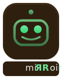

<p align="center">
  
</p>

# mirroir-mcp

[](https://www.npmjs.com/package/mirroir-mcp)
[](https://github.com/jfarcand/mirroir-mcp/actions/workflows/build.yml)
[](https://github.com/jfarcand/mirroir-mcp/actions/workflows/install.yml)
[](https://github.com/jfarcand/mirroir-mcp/actions/workflows/installers.yml)
[](https://github.com/jfarcand/mirroir-mcp/actions/workflows/mcp-compliance.yml)
[](LICENSE)
[](https://support.apple.com/en-us/105071)
[](https://discord.gg/jVDBbMjPMf)

Give your AI eyes, hands, and a real iPhone. An MCP server that lets any AI agent see the screen, tap what it needs, and figure the rest out — through macOS iPhone Mirroring. Experimental support for macOS windows. [32 tools](docs/tools.md), any MCP client.

## Requirements

- macOS 15+
- iPhone connected via [iPhone Mirroring](https://support.apple.com/en-us/105071)

## Install

```bash
/bin/bash -c "$(curl -fsSL https://mirroir.dev/get-mirroir.sh)"
```

or via [npx](https://www.npmjs.com/package/mirroir-mcp):

```bash
npx -y mirroir-mcp install
```

or via [Homebrew](https://tap.mirroir.dev):

```bash
brew tap jfarcand/tap && brew install mirroir-mcp
```

The first time you take a screenshot, macOS will prompt for **Screen Recording** and **Accessibility** permissions. Grant both.

<details>
<summary>Per-client setup</summary>

#### Claude Code

```bash
claude mcp add --transport stdio mirroir -- npx -y mirroir-mcp
```

#### GitHub Copilot (VS Code)

Install from the MCP server gallery: search `@mcp mirroir` in the Extensions view, or add to `.vscode/mcp.json`:

```json
{
  "servers": {
    "mirroir": {
      "type": "stdio",
      "command": "npx",
      "args": ["-y", "mirroir-mcp"]
    }
  }
}
```

#### Cursor

Add to `.cursor/mcp.json` in your project root:

```json
{
  "mcpServers": {
    "mirroir": {
      "command": "npx",
      "args": ["-y", "mirroir-mcp"]
    }
  }
}
```

#### OpenAI Codex

```bash
codex mcp add mirroir -- npx -y mirroir-mcp
```

Or add to `~/.codex/config.toml`:

```toml
[mcp_servers.mirroir]
command = "npx"
args = ["-y", "mirroir-mcp"]
```

</details>

<details>
<summary>Install from source</summary>

```bash
git clone https://github.com/jfarcand/mirroir-mcp.git
cd mirroir-mcp
./mirroir.sh
```

Use the full path to the binary in your `.mcp.json`: `<repo>/.build/release/mirroir-mcp`.

</details>

## How it works

Every interaction follows the same loop: **observe, reason, act**. `describe_screen` gives the AI every text element with tap coordinates (eyes). The LLM decides what to do next (brain). `tap`, `type_text`, `swipe` execute the action (hands) — then it loops back to observe. No scripts, no coordinates, just intent.

## Examples

Paste any of these into Claude Code, Claude Desktop, ChatGPT, Cursor, or any MCP client:

```
Open Messages, find my conversation with Alice, and send "running 10 min late".
```

```
Open Calendar, create a new event called "Dentist" next Tuesday at 2pm.
```

```
Open my Expo Go app, tap "LoginDemo", test the login screen with
test@example.com / password123. Screenshot after each step.
```

```
Start recording, open Settings, scroll to General > About, stop recording.
```

## Screen Intelligence

`describe_screen` is the AI's eyes. Three backends work together to give the agent a complete picture of what's on screen — text, icons, and semantic UI structure.

### Apple Vision OCR (default)

The default backend uses Apple's Vision framework to detect every text element on screen and return exact tap coordinates. This is fast, local, and requires no API keys or external services.

### Icon Detection (YOLO CoreML)

Text-only OCR misses non-text UI elements — buttons, toggles, tab bar icons, activity rings. Drop a YOLO CoreML model (`.mlmodelc`) in `~/.mirroir-mcp/models/` and the server auto-detects it at startup, merging icon detection results with OCR text. The AI gets tap targets for elements that text-only OCR cannot see.

| Mode | `ocrBackend` setting | Behavior |
|------|---------------------|----------|
| Auto-detect (default) | `"auto"` | Uses Vision + YOLO if a model is installed, Vision only otherwise |
| Vision only | `"vision"` | Apple Vision OCR text only |
| YOLO only | `"yolo"` | CoreML element detection only |
| Both | `"both"` | Always merge both backends (falls back to Vision if no model) |

### AI Vision Mode (embacle)

Instead of local OCR, `describe_screen` can send the screenshot to an AI vision model that identifies UI elements semantically — cards, tabs, buttons, icons, navigation structure — not just raw text. This produces richer context for the agent, especially on screens with complex layouts.

The [embacle](https://github.com/dravr-ai/dravr-embacle) runtime is embedded directly into the mirroir-mcp binary via Rust FFI. When vision mode is enabled, `describe_screen` calls the embedded runtime in-process — no separate server, no network round-trip, no additional setup. The FFI layer (`EmbacleFFI.swift` → `libembacle.a`) handles initialization, chat completion requests, and memory management across the Swift/Rust boundary.

embacle routes vision requests through already-authenticated CLI tools (GitHub Copilot, Claude Code) so there is no separate API key to manage. If you have a Copilot or Claude Code subscription, you already have access.

```json
// .mirroir-mcp/settings.json
{
  "agent": "embacle",
  "screenDescriberMode": "vision"
}
```

Or via environment variables:

```bash
MIRROIR_AGENT=embacle MIRROIR_SCREEN_DESCRIBER_MODE=vision
```

| Setting | Default | Description |
|---------|---------|-------------|
| `screenDescriberMode` | `"ocr"` | `"ocr"` for local Vision OCR + YOLO, `"vision"` for AI vision model |
| `agent` | `""` | Agent name for vision mode (e.g. `"embacle"`) |
| `visionImageWidth` | `500` | Target image width in pixels for vision API calls |

When `screenDescriberMode` is `"ocr"` (default), nothing changes — the server uses Apple Vision OCR as before.

## Skills

When you find yourself repeating the same agent workflow, capture it as a skill. Skills are SKILL.md files — numbered steps the AI follows, adapting to layout changes and unexpected dialogs. Steps like `Tap "Email"` use OCR — no hardcoded coordinates.

Place files in `~/.mirroir-mcp/skills/` (global) or `<cwd>/.mirroir-mcp/skills/` (project-local).

```markdown
---
version: 1
name: Commute ETA Notification
app: Waze, Messages
tags: ["workflow", "cross-app"]
---

## Steps

1. Launch **Waze**
2. Wait for "Où va-t-on ?" to appear
3. Tap "Où va-t-on ?"
4. Wait for "${DESTINATION:-Travail}" to appear
5. Tap "${DESTINATION:-Travail}"
6. Wait for "Y aller" to appear
7. Tap "Y aller"
8. Wait for "min" to appear
9. Remember: Read the commute time and ETA.
10. Press Home
11. Launch **Messages**
12. Tap "New Message"
13. Type "${RECIPIENT}" and select the contact
14. Type "On my way! ETA {eta}"
15. Press **Return**
16. Screenshot: "message_sent"
```

`${VAR}` placeholders resolve from environment variables. `${VAR:-default}` for fallbacks.

### Skill Marketplace

Install ready-to-use skills from [jfarcand/mirroir-skills](https://github.com/jfarcand/mirroir-skills):

```bash
git clone https://github.com/jfarcand/mirroir-skills ~/.mirroir-mcp/skills
```

## From Exploration to CI

Point mirroir at any app — it autonomously discovers every reachable screen using BFS graph traversal (screens are nodes, taps are edges), then outputs ready-to-run SKILL.md files.

### Generate

A single `generate_skill(action: "explore")` call runs autonomous BFS traversal — exploring each screen breadth-first, replaying paths to reach child screens, building a navigation graph of the entire app.

### Test

Run skills deterministically from the CLI — no AI in the loop:

```bash
mirroir test apps/settings/check-about
mirroir test --junit results.xml --verbose        # JUnit output
mirroir test --dry-run apps/settings/check-about    # validate without executing
```

| Option | Description |
|---|---|
| `--junit <path>` | Write JUnit XML report |
| `--screenshot-dir <dir>` | Save failure screenshots (default: `./mirroir-test-results/`) |
| `--timeout <seconds>` | `wait_for` timeout (default: 15) |
| `--verbose` | Step-by-step detail |
| `--dry-run` | Parse and validate without executing |
| `--no-compiled` | Skip compiled skills, force full OCR |

Exit code `0` = all pass, `1` = any failure.

### Compiled Skills

Compile a skill once to capture coordinates and timing. Replay with zero OCR — a 10-step skill drops from 5+ seconds of OCR to under a second.

```bash
mirroir compile apps/settings/check-about        # compile
mirroir test apps/settings/check-about            # auto-detects .compiled.json
mirroir test --no-compiled check-about            # force full OCR
```

AI agents auto-compile skills as a side-effect of the first MCP run. See [Compiled Skills](docs/compiled-skills.md) for details.

### AI-Assisted Diagnosis

When a test step fails, pass `--agent` to get an AI diagnosis of what went wrong and suggested fixes:

```bash
mirroir test --agent gpt-5.3 apps/settings/check-about
mirroir test --agent claude-sonnet-4-6 apps/settings/check-about
mirroir test --agent ollama:llama3 apps/settings/check-about
mirroir test --agent embacle apps/settings/check-about
```

Built-in agents:

| Agent | Provider | API Key |
|-------|----------|---------|
| `gpt-5.3` | OpenAI | `OPENAI_API_KEY` |
| `claude-sonnet-4-6`, `claude-haiku-4-5` | Anthropic | `ANTHROPIC_API_KEY` |
| `ollama:<model>` | [Ollama](https://ollama.com) (local) | None |
| `embacle`, `embacle:claude` | [embacle-server](https://github.com/dravr-ai/dravr-embacle) | CLI agent key |

Custom agents can be defined as YAML profiles in `~/.mirroir-mcp/agents/`.

<details>
<summary>No API key? Use embacle</summary>

[embacle](https://github.com/dravr-ai/dravr-embacle) routes requests through already-authenticated CLI tools (GitHub Copilot, Claude Code, etc.) — no separate API key needed:

```bash
brew tap dravr-ai/tap && brew install embacle
mirroir test --agent embacle my-skill
```

</details>

## Component Detection

Raw OCR returns a flat list of text elements with no structure. Component definitions teach the explorer what UI patterns look like — a `.md` file per pattern (table rows, toggles, tab bars, summary cards). The explorer matches screen regions against these definitions to decide what to tap, what to skip, and when to backtrack.

20 iOS component definitions are included. Place custom definitions in `~/.mirroir-mcp/components/` or `<cwd>/.mirroir-mcp/components/`.

Test a definition against the current live screen:

```
Use calibrate_component with my-component.md to check how it matches.
```

See [Component Detection](docs/components.md) for the definition format, match rules, and the detection pipeline.

## Security

Giving an AI access to your phone demands defense in depth. mirroir-mcp is **fail-closed** at every layer.

- **Tool permissions** — Without a config file, only read-only tools (`screenshot`, `describe_screen`) are exposed. Mutating tools are hidden from the MCP client entirely — it never sees them.
- **App blocking** — `blockedApps` in `permissions.json` prevents the AI from interacting with sensitive apps like Wallet or Banking, even if mutating tools are allowed.
- **No root required** — Runs as a regular user process using the macOS CGEvent API. No daemons, no kernel extensions, no root privileges — just Accessibility permissions.
- **Kill switch** — Close iPhone Mirroring to kill all input instantly.

```json
// ~/.mirroir-mcp/permissions.json
{
  "allow": ["tap", "swipe", "type_text", "press_key", "launch_app"],
  "deny": [],
  "blockedApps": ["Wallet", "Banking"]
}
```

See [Permissions](docs/permissions.md) and [Security](docs/security.md) for the full threat model.

## CLI Tools

### Recorder

Record interactions as a skill file:

```bash
mirroir record -o login-flow.yaml -n "Login Flow" --app "MyApp"
```

### Doctor

Verify your setup:

```bash
mirroir doctor
mirroir doctor --json    # machine-readable output
```

### Configure

Set up your keyboard layout for non-US keyboards:

```bash
mirroir configure
```

## Updating

```bash
# curl installer
/bin/bash -c "$(curl -fsSL https://mirroir.dev/get-mirroir.sh)"

# npx
npx -y mirroir-mcp install

# Homebrew
brew upgrade mirroir-mcp

# From source
git pull && swift build -c release
```

## Uninstall

```bash
# Homebrew
brew uninstall mirroir-mcp

# From source
./uninstall-mirroir.sh
```

## Configuration

Override timing defaults via `settings.json`:

```json
// .mirroir-mcp/settings.json (project-local) or ~/.mirroir-mcp/settings.json (global)
{
  "keystrokeDelayUs": 20000,
  "clickHoldUs": 100000
}
```

Environment variables also work: `MIRROIR_KEYSTROKE_DELAY_US`. See [`TimingConstants.swift`](Sources/HelperLib/TimingConstants.swift) for all keys.

## Documentation

| | |
|---|---|
| [Tools Reference](docs/tools.md) | All 32 tools, parameters, and input workflows |
| [FAQ](docs/faq.md) | Security, focus stealing, keyboard layouts |
| [Security](docs/security.md) | Threat model, kill switch, and recommendations |
| [Permissions](docs/permissions.md) | Fail-closed permission model and config file |
| [Known Limitations](docs/limitations.md) | Focus stealing, keyboard layout gaps, autocorrect |
| [Component Detection](docs/components.md) | Component definitions, calibration, and the detection pipeline |
| [Compiled Skills](docs/compiled-skills.md) | Zero-OCR skill replay |
| [Testing](docs/testing.md) | FakeMirroring, integration tests, and CI strategy |
| [Troubleshooting](docs/troubleshooting.md) | Debug mode and common issues |
| [Contributing](CONTRIBUTING.md) | How to add tools, commands, and tests |
| [Skills Marketplace](docs/skills-marketplace.md) | Skill format, plugin discovery, and authoring |

## Community

Join the [Discord server](https://discord.gg/jVDBbMjPMf) to ask questions, share skills, and discuss ideas.

## Contributing

Contributions welcome. By submitting a patch, you agree to the [Contributor License Agreement](CLA.md) — your Git commit metadata serves as your electronic signature.

---

> **Why "mirroir"?** — It's the old French spelling of *miroir* (mirror). A nod to the author's roots, not a typo.
