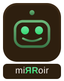
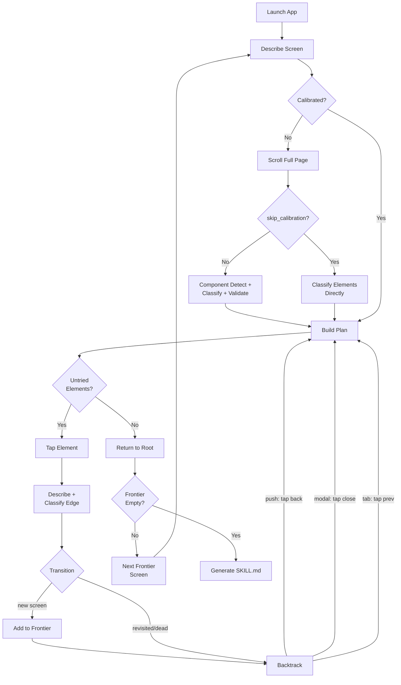

<p align="center">
  
</p>

# mirroir-mcp

[](https://www.npmjs.com/package/mirroir-mcp)
[](https://github.com/jfarcand/mirroir-mcp/actions/workflows/build.yml)
[](https://github.com/jfarcand/mirroir-mcp/actions/workflows/install.yml)
[](https://github.com/jfarcand/mirroir-mcp/actions/workflows/installers.yml)
[](https://github.com/jfarcand/mirroir-mcp/actions/workflows/mcp-compliance.yml)
[](LICENSE)
[](https://support.apple.com/en-us/105071)
[](https://discord.gg/jVDBbMjPMf)

Give your AI eyes, hands, and a real iPhone. An MCP server that lets any AI agent see the screen, tap what it needs, and figure the rest out — through macOS iPhone Mirroring. Experimental support for macOS windows. [38 tools](docs/tools.md), any MCP client.

## Requirements

- macOS 15+
- iPhone connected via [iPhone Mirroring](https://support.apple.com/en-us/105071)

## Install

```bash
/bin/bash -c "$(curl -fsSL https://mirroir.dev/get-mirroir.sh)"
```

or via [npx](https://www.npmjs.com/package/mirroir-mcp):

```bash
npx -y mirroir-mcp install
```

or via [Homebrew](https://tap.mirroir.dev):

```bash
brew tap jfarcand/tap && brew install mirroir-mcp
```

The first time you take a screenshot, macOS will prompt for **Screen Recording** and **Accessibility** permissions. Grant both.

<details>
<summary>Per-client setup</summary>

#### Claude Code

```bash
claude mcp add --transport stdio mirroir -- npx -y mirroir-mcp
```

#### GitHub Copilot (VS Code)

Install from the MCP server gallery: search `@mcp mirroir` in the Extensions view, or add to `.vscode/mcp.json`:

```json
{
  "servers": {
    "mirroir": {
      "type": "stdio",
      "command": "npx",
      "args": ["-y", "mirroir-mcp"]
    }
  }
}
```

#### Cursor

Add to `.cursor/mcp.json` in your project root:

```json
{
  "mcpServers": {
    "mirroir": {
      "command": "npx",
      "args": ["-y", "mirroir-mcp"]
    }
  }
}
```

#### OpenAI Codex

```bash
codex mcp add mirroir -- npx -y mirroir-mcp
```

Or add to `~/.codex/config.toml`:

```toml
[mcp_servers.mirroir]
command = "npx"
args = ["-y", "mirroir-mcp"]
```

</details>

<details>
<summary>Install from source</summary>

```bash
git clone https://github.com/jfarcand/mirroir-mcp.git
cd mirroir-mcp
./mirroir.sh
```

Use the full path to the binary in your `.mcp.json`: `<repo>/.build/release/mirroir-mcp`.

</details>

## How it works

Every interaction follows the same loop: **observe, reason, act**. `describe_screen` gives the AI every text element with tap coordinates (eyes). The LLM decides what to do next (brain). `tap`, `type_text`, `swipe` execute the action (hands) — then it loops back to observe. No scripts, no coordinates, just intent.

Beyond the basics, the server exposes higher-level navigation and lifecycle tools: `press_back` navigates back by OCR-tapping the "<" chevron (with a canonical-position fallback), `press_home`/`press_app_switcher`/`spotlight` drive system gestures, `scroll_to` scrolls until a target text becomes visible, `reset_app` force-quits an app via the App Switcher, `set_network` toggles connectivity through Settings, and `measure` times how long an action takes to surface a target element. Multi-target setups use `list_targets`/`switch_target` to move between window automation endpoints. Skill authoring is served by `record_step` and `save_compiled` (compiled replay) and `calibrate_component` (test a component definition against the live screen). See the [Tools Reference](docs/tools.md) for all 38 tools.

## Describe Your App

mirroir can explore any iOS app blindly, but it works better when you tell it what to expect. Write an `APP.md` file and mirroir reads it before exploration starts:

```markdown
---
app: Santé
archetype: dashboard
obstacle_mode: auto
---

## Structure
Dashboard with 4 tabs: Résumé, Partage, Parcourir, Profil.

## Résumé Tab
- Summary cards for health metrics that drill down to charts
- Cards often show "Aucune donnée" on test devices

## Obstacles
- Health Access permission → tap "Autoriser"
- Notification permission → tap "Ne pas autoriser"

## Skip
- Supprimer les données de Santé
- Réinitialiser
```

What the code actually uses today: `archetype` overrides recipe auto-detection; `obstacles` are auto-dismissed when `obstacle_mode: auto`; `skip` merges with `permissions.json.skipElements`; `tabs` (inline or as a section) are injected as high-priority targets; Structure + tab body + Tips become AI context in generated skills.

See the [APP.md specification](docs/APP.md.spec.md) for the complete field list, loader resolution rules, and the permission-system bridge. Three levels of patterns work together — elements (what rows look like), screens (what the page layout means), and apps (what the developer knows). [Patterns & Skills](docs/components.md) covers the full system.

## Examples

Paste any of these into Claude Code, Claude Desktop, ChatGPT, Cursor, or any MCP client:

```
Open Messages, find my conversation with Alice, and send "running 10 min late".
```

```
Open Calendar, create a new event called "Dentist" next Tuesday at 2pm.
```

```
Open my Expo Go app, tap "LoginDemo", test the login screen with
test@example.com / password123. Screenshot after each step.
```

```
Start recording, open Settings, scroll to General > About, stop recording.
```

## Games

Games get three controls through iPhone Mirroring: `touch` holds a finger across calls for virtual joysticks and press-and-hold (`begin`, `move`, `end`); `hold_keys` holds keys such as `w` while dragging the right mouse button, for games that switch to keyboard and mouse controls like Roblox; `pinch` and `rotate` drive two-finger zoom and rotation in gesture-recognizer UIs. Mirroring exposes a single pointer touch to apps, so a touch-only game cannot receive two independent fingers — see [Games and Multi-Touch](docs/tools.md#games-and-multi-touch) for what was measured.

## Screen Intelligence

`describe_screen` is the AI's eyes. Three backends work together to give the agent a complete picture of what's on screen — text, icons, and semantic UI structure.

### Apple Vision OCR (default)

The default backend uses Apple's Vision framework to detect every text element on screen and return exact tap coordinates. This is fast, local, and requires no API keys or external services.

### Icon Detection (YOLO CoreML)

Text-only OCR misses non-text UI elements — buttons, toggles, tab bar icons, activity rings. Drop a YOLO CoreML model (`.mlmodelc`) in `~/.mirroir-mcp/models/` and the server auto-detects it at startup, merging icon detection results with OCR text. The AI gets tap targets for elements that text-only OCR cannot see.

| Mode | `ocrBackend` setting | Behavior |
|------|---------------------|----------|
| Auto-detect (default) | `"auto"` | Uses Vision + YOLO if a model is installed, Vision only otherwise |
| Vision only | `"vision"` | Apple Vision OCR text only |
| YOLO only | `"yolo"` | CoreML element detection only |
| Both | `"both"` | Always merge both backends (falls back to Vision if no model) |

### AI Vision Mode (embacle)

Instead of local OCR, `describe_screen` can send the screenshot to an AI vision model that identifies UI elements semantically — cards, tabs, buttons, icons, navigation structure — not just raw text. This produces richer context for the agent, especially on screens with complex layouts.

The [embacle](https://github.com/dravr-ai/dravr-embacle) runtime is embedded directly into the mirroir-mcp binary via Rust FFI. `describe_screen` calls the embedded runtime in-process — no separate server, no network round-trip, no additional setup. The FFI layer (`EmbacleFFI.swift` → `libembacle.a`) handles initialization, chat completion requests, and memory management across the Swift/Rust boundary.

embacle routes vision requests through already-authenticated CLI tools (GitHub Copilot, Claude Code) so there is no separate API key to manage. If you have a Copilot or Claude Code subscription, you already have access.

#### Install

```bash
brew tap dravr-ai/tap
brew trust --tap dravr-ai/tap # recent Homebrew refuses to load untrusted taps
brew install embacle          # CLI tools (embacle-server, embacle-mcp)
brew install embacle-ffi      # Rust FFI static library (libembacle.a)
```

Both are optional. Without `embacle-ffi` the build links against Apple Vision
and `describe_screen` uses local OCR.

Then rebuild mirroir-mcp from source (or reinstall via Homebrew) so the binary links against `libembacle.a`:

```bash
# From source
swift build -c release

# Or via Homebrew (rebuilds automatically)
brew reinstall mirroir-mcp
```

#### Zero-config activation

When the embacle FFI is linked into the binary, `screenDescriberMode` defaults to `"auto"` which automatically resolves to vision mode. No settings change required — install embacle-ffi, rebuild, and `describe_screen` starts using AI vision.

To force local OCR even when embacle is available, explicitly set `"ocr"`:

```json
// .mirroir-mcp/settings.json
{
  "screenDescriberMode": "ocr"
}
```

See [Configuration](#configuration) for all available settings.

## Skills

When you find yourself repeating the same agent workflow, capture it as a skill. Skills are SKILL.md files — numbered steps the AI follows, adapting to layout changes and unexpected dialogs. Steps like `Tap "Email"` use OCR — no hardcoded coordinates.

Place files in `~/.mirroir-mcp/skills/` (global) or `<cwd>/.mirroir-mcp/skills/` (project-local).

### APP.md

Describe your app's structure to guide exploration — see [Describe Your App](#describe-your-app) above and the full [APP.md specification](docs/APP.md.spec.md). Place APP.md files in `~/.mirroir-mcp/skills/` or the [mirroir-skills](https://github.com/jfarcand/mirroir-skills) repo at `patterns/apps/`.

```markdown
---
version: 1
name: Commute ETA Notification
app: Waze, Messages
tags: ["workflow", "cross-app"]
---

## Steps

1. Launch **Waze**
2. Wait for "Où va-t-on ?" to appear
3. Tap "Où va-t-on ?"
4. Wait for "${DESTINATION:-Travail}" to appear
5. Tap "${DESTINATION:-Travail}"
6. Wait for "Y aller" to appear
7. Tap "Y aller"
8. Wait for "min" to appear
9. Remember: Read the commute time and ETA.
10. Press Home
11. Launch **Messages**
12. Tap "New Message"
13. Type "${RECIPIENT}" and select the contact
14. Type "On my way! ETA {eta}"
15. Press **Return**
16. Screenshot: "message_sent"
```

`${VAR}` placeholders resolve from environment variables. `${VAR:-default}` for fallbacks.

### Skill Marketplace

Install ready-to-use skills from [jfarcand/mirroir-skills](https://github.com/jfarcand/mirroir-skills):

```bash
git clone https://github.com/jfarcand/mirroir-skills ~/.mirroir-mcp/skills
```

## From Exploration to CI

The `generate_skill` tool lets an AI agent explore an app and produce SKILL.md files. It uses [breadth-first search](https://en.wikipedia.org/wiki/Breadth-first_search) (BFS) to traverse the app as a navigation graph — screens are nodes, tappable elements are edges. The explorer describes each screen, matches elements against [component definitions](#component-detection) to decide what to tap, visits child screens, and backtracks via the back chevron. Duplicate screens are skipped via structural fingerprinting. See [Component Detection](#component-detection) below for how the explorer interprets raw elements into structured UI components.

The explorer works viewport-by-viewport: after calibrating the page length, it builds a plan from the current viewport, taps elements top-to-bottom, scrolls down to reveal more content, and rebuilds the plan for each new viewport. This approach works with both OCR and AI vision describers. Pass `seed` for deterministic ordering across runs.

Exploration is bounded — it does not discover every reachable screen in large apps. Depth, screen count, and time limits keep runs practical. For targeted flows, provide a `goal` to focus the traversal.


```mermaid
graph TD
    A["Launch App"] --> B["Describe Screen"]
    B --> C{"Calibrated?"}
    C -- No --> D["Scroll Full Page"]
    D --> E{"skip_calibration?"}
    E -- No --> F["Component Detect +\nClassify + Validate"]
    E -- Yes --> G["Classify Elements\nDirectly"]
    F --> H["Build Plan"]
    G --> H
    C -- Yes --> H

    H --> I{"Untried\nElements?"}
    I -- Yes --> J["Tap Element"]
    I -- No --> K["Return to Root"]

    J --> M["Describe +\nClassify Edge"]
    M --> N{"Transition"}
    N -- new screen --> O["Add to Frontier"]
    O --> P["Backtrack"]
    N -- revisited/dead --> P

    P -- push: tap back --> H
    P -- modal: tap close --> H
    P -- tab: tap prev --> H

    K --> Q{"Frontier\nEmpty?"}
    Q -- No --> R["Next Frontier\nScreen"]
    R --> B
    Q -- Yes --> S["Generate SKILL.md"]
```

### Generate

Two modes: **autonomous exploration** (BFS) and **guided session** (manual step-by-step).

**Autonomous BFS exploration** — the agent explores on its own:

```
Explore the Settings app and generate a skill that checks the iOS version.
```

This calls `generate_skill(action: "explore", app_name: "Settings", goal: "check iOS version")` under the hood. The explorer launches the app, runs BFS from the root screen, and outputs a SKILL.md for the discovered path.

| Parameter | Default | Description |
|-----------|---------|-------------|
| `app_name` | required | App to explore |
| `goal` | none | Focus exploration toward a specific flow (e.g. "check software version") |
| `goals` | none | Array of goals — one SKILL.md per goal |
| `max_depth` | 6 | Maximum BFS depth |
| `max_screens` | 30 | Maximum screens to visit |
| `max_time` | 300 | Maximum seconds before stopping |
| `strategy` | auto | `"mobile"` (default), `"social"` (Reddit, Instagram, TikTok), or `"desktop"` (macOS windows) |
| `explorer` | `bfs` | Exploration algorithm: `"bfs"` (breadth-first, default) or `"dfs"` (depth-first) |
| `skip_calibration` | false | Skip component detection during calibration. Scrolling still runs. Useful with AI vision describers that produce clean semantic elements |
| `seed` | random | Integer seed for deterministic exploration ordering. Same seed produces identical tap sequences |
| `fresh` | true | Discard persisted navigation graph and explore from scratch. Set `false` for incremental exploration |

**Guided session** — the AI navigates manually, capturing each screen:

1. `generate_skill(action: "start", app_name: "MyApp")` — launch app, OCR first screen
2. Use `tap`/`swipe`/`type_text` to navigate, then `generate_skill(action: "capture")` to record each screen
3. `generate_skill(action: "finish")` — assemble captured screens into a SKILL.md

### Test

Run skills deterministically from the CLI — no AI in the loop:

```bash
mirroir test apps/settings/check-about
mirroir test --junit results.xml --verbose        # JUnit output
mirroir test --dry-run apps/settings/check-about    # validate without executing
```

| Option | Description |
|---|---|
| `--junit <path>` | Write JUnit XML report |
| `--screenshot-dir <dir>` | Save failure screenshots (default: `./mirroir-test-results/`) |
| `--timeout <seconds>` | `wait_for` timeout (default: 15) |
| `--verbose` | Step-by-step detail |
| `--dry-run` | Parse and validate without executing |
| `--no-compiled` | Skip compiled skills, force full OCR |
| `--no-auto-recompile` | Skip auto-recompilation of compiled skills that have drifted |
| `--agent <name>` | AI diagnosis of a failed step (see [AI-Assisted Diagnosis](#ai-assisted-diagnosis)) |

Exit code `0` = all pass, `1` = any failure.

By default the CLI auto-recompiles a compiled skill whose screen fingerprint has drifted; `--no-auto-recompile` disables that and reuses the stale coordinates.

### Compiled Skills

Compile a skill once to capture coordinates and timing. Replay with zero OCR — a 10-step skill drops from 5+ seconds of OCR to under a second.

```bash
mirroir compile apps/settings/check-about        # compile
mirroir test apps/settings/check-about            # auto-detects .compiled.json
mirroir test --no-compiled check-about            # force full OCR
```

AI agents auto-compile skills as a side-effect of the first MCP run. See [Compiled Skills](docs/compiled-skills.md) for details.

### AI-Assisted Diagnosis

When a test step fails, pass `--agent` to get an AI diagnosis of what went wrong and suggested fixes:

```bash
mirroir test --agent gpt-5.3 apps/settings/check-about
mirroir test --agent claude-sonnet-4-6 apps/settings/check-about
mirroir test --agent ollama:llama3 apps/settings/check-about
mirroir test --agent embacle apps/settings/check-about
```

Built-in agents:

| Agent | Provider | API Key |
|-------|----------|---------|
| `gpt-5.3` | OpenAI | `OPENAI_API_KEY` |
| `claude-sonnet-4-6`, `claude-haiku-4-5` | Anthropic | `ANTHROPIC_API_KEY` |
| `ollama:<model>` | [Ollama](https://ollama.com) (local) | None |
| `embacle`, `embacle:claude` | [embacle-server](https://github.com/dravr-ai/dravr-embacle) | CLI agent key |

Custom agents are defined as YAML profiles in `<cwd>/.mirroir-mcp/agents/<name>.yaml` (project-local) or `~/.mirroir-mcp/agents/<name>.yaml` (global, project-local wins). Pass the file's `<name>` to `--agent`.

A profile runs in one of two modes:

**`mode: api`** — call a cloud or local HTTP endpoint:

```yaml
# ~/.mirroir-mcp/agents/my-gpt.yaml
mode: api
provider: openai          # anthropic | openai | ollama | embacle
model: gpt-5.3
api_key_env: OPENAI_API_KEY
base_url: https://api.openai.com
system_prompt: "You are a terse iOS automation debugger."
max_tokens: 4096
```

**`mode: command`** — run a local CLI process (e.g. an already-authenticated `claude -p` / `copilot -p`, or a custom script). The diagnostic payload is delivered two ways: if any `args` entry contains `${PAYLOAD}`, the JSON payload is substituted there; otherwise it is piped to the command's stdin:

```yaml
# ~/.mirroir-mcp/agents/claude-cli.yaml
mode: command
command: claude
args: ["-p", "${PAYLOAD}"]
system_prompt: "Diagnose the failed step and reply with JSON."
```

| Key | Mode | Description |
|---|---|---|
| `mode` | both | `api` (default) or `command` |
| `provider` | api | `anthropic`, `openai`, `ollama`, or `embacle` |
| `model` | api | Model identifier |
| `api_key_env` | api | Environment variable holding the API key |
| `base_url` | api | Endpoint base URL |
| `command` | command | Executable to launch (`PATH`-resolved, or an absolute path) |
| `args` | command | Argument array; `${PAYLOAD}` is replaced with the JSON payload |
| `system_prompt` | both | System prompt sent with the request |
| `max_tokens` | both | Response token budget |

<details>
<summary>No API key? Use embacle</summary>

[embacle](https://github.com/dravr-ai/dravr-embacle) routes requests through already-authenticated CLI tools (GitHub Copilot, Claude Code, etc.) — no separate API key needed:

```bash
brew tap dravr-ai/tap && brew trust --tap dravr-ai/tap && brew install embacle
mirroir test --agent embacle my-skill
```

</details>

### Pattern System

The explorer uses a three-layer pattern system to understand iOS apps — the same declarative concept at different scales:

- **Element patterns** (`patterns/elements/`) — 34 definitions matching row-level UI components (table rows, tab bars, toggles, summary cards). Each specifies match rules, interaction behavior, and grouping logic.
- **Screen patterns** (`patterns/screens/`) — 7 archetype recipes that identify screen-level navigation models from element composition. Auto-detected during calibration, or declared via `archetype` in APP.md.
- **App patterns** (`patterns/apps/`) — APP.md files with structure, obstacles, skip lists, and archetype declarations. The developer's source of truth.

Built-in archetypes: `settings-list`, `dashboard`, `social-feed`, `content-grid`, `conversation-list`, `utility-display`, `detail-form`.

Place custom patterns in `~/.mirroir-mcp/components/` (elements), `~/.mirroir-mcp/recipes/` (screens), or the [mirroir-skills](https://github.com/jfarcand/mirroir-skills) repo.

#### Vision Indicators

AI vision describers describe UI elements semantically ("Activité chevron") rather than character-by-character ("Activité" + ">"). A `vision-indicators.md` file maps these descriptions to OCR-compatible characters so the component pipeline works identically with both backends:

```markdown
## Indicators
- chevron: >
- dismiss: ×
- back: <
```

When a vision element ends with a mapped suffix (e.g. "Entraînements chevron"), the normalizer splits it into two elements: "Entraînements" + ">". Place `vision-indicators.md` alongside your component definitions.

See [Component Detection](docs/components.md) for the full definition format, match rule reference, and the detection pipeline.

## Replay anywhere with `mirroir-run`

`mirroir-mcp` captures iOS flows — AX + OCR + BFS exploration. `mirroir-run` replays `.mirroir/` SkillStep scenarios on Linux CI against **web, process, and HTTP** surfaces. Both speak one SkillStep grammar, so an iOS capture and a web scenario are the same language on two surfaces — tied together by `cross_surface` equivalence rather than maintained as two bespoke suites. A single Rust binary (`runner/` in this repo), independent of the Swift server.

Drop a `.mirroir/` directory in any repo and `mirroir-run` discovers it from the working directory:

```
your-app/
└── .mirroir/
    ├── mirroir.yaml          # the plan: must-pass / nice-to-pass entries
    └── apps/<sample>/
        ├── SAMPLE.md         # how to boot the app under test
        ├── APP.md            # structure, obstacles, skip lists
        └── scenarios/*.yaml  # SkillStep flows to replay
```

```bash
cd your-app
mirroir-run                          # discover .mirroir/, replay the must-pass plan
mirroir-run --scenarios all          # include nice-to-pass entries too
```

Each plan entry either points at a `local:` sample tree or extends a shared **archetype** (`archetypes: ["<pack>/<name>@<ver>"]`) with per-instance `vars:` and `boot:`. An archetype captures a reusable app shape — say, an AI chat console — once, and parameterizes it per app.

**Where the iOS leg comes from.** `generate_skill … emit=true` (on `finish` or `explore`) writes the captured flow into `.mirroir/apps/<app>/` as an iOS capture of the walk plus a cross-surface oracle (`baselines/<flow>.ios.txt`) and a `cross_surface` parity gate — additive to the web leg's runnable scenarios. The capture declares `target: { kind: ios }`, a surface `mirroir-run` has no executor for, so the runner refuses it by name; the baseline and the parity gate are the parts it consumes. Run the MCP from your consumer repo (or pass `output_dir`) so the tree lands in the right `.mirroir/`; emitting into `~/.mirroir` (the runner's pack home) is refused. Pair it with a web capture and `mirroir-run` asserts the two surfaces stay equivalent. See [`runner/docs/mirroir-dotfile.md`](runner/docs/mirroir-dotfile.md) for the pairing convention.

Web steps compile to a Playwright `.spec.ts` and run across chromium, firefox, and webkit. Selectors resolve three ways: raw CSS, Playwright engine prefixes (`role=button[name="Save"]`, `text=Welcome`, `xpath=…`), or a bare label resolved in Playwright's own priority — role, label, placeholder, `data-test`, visible text. Every compiled spec also collects uncaught page errors and failed responses, so a page that throws is a failure even when every locator resolved. The spec, its config, and the trace / video / screenshot of a failure persist under `target/playwright/<sample>/<scenario>/`. Process and HTTP steps dispatch natively; an LLM judge step scores agent responses against expected signals, and drift detection catches output divergence vs. a baseline.

| Mode | Command |
|---|---|
| Validate a scenario against the grammar | `mirroir-run --validate scenario.yaml` |
| Compile the Playwright spec to disk | `mirroir-run --emit playwright scenario.yaml` |
| Run one scenario end-to-end | `mirroir-run --run-scenario scenario.yaml` |
| Boot a sample dir, run its scenarios | `mirroir-run --sample .mirroir/apps/foo` |
| Standalone text drift check | `mirroir-run --diff-text a.txt b.txt` |

### Install `mirroir-run`

```bash
# crates.io
cargo install mirroir-run

# Homebrew
brew install jfarcand/tap/mirroir-run
```

Prebuilt binaries for macOS (Intel + Apple Silicon), Linux (gnu + musl), and Windows are attached to each [`runner-v*` release](https://github.com/jfarcand/mirroir-mcp/releases). See [`runner/docs/`](runner/docs/) for the scenario grammar, `SAMPLE.md` schema, judge profiles, and CI integration.

## Security

Giving an AI access to your phone demands defense in depth. mirroir-mcp is **fail-closed** at every layer.

- **Tool permissions** — Without a config file, only the 11 read-only tools (`screenshot`, `describe_screen`, `start_recording`, `stop_recording`, `get_orientation`, `status`, `check_health`, `list_targets`, `list_skills`, `get_skill`, `calibrate_component`) are exposed. Every mutating tool — including `press_back` — is hidden from the MCP client entirely, so it never sees them.
- **App blocking** — `blockedApps` in `permissions.json` prevents the AI from interacting with sensitive apps like Wallet or Banking, even if mutating tools are allowed.
- **No root required** — Runs as a regular user process using the macOS CGEvent API. No daemons, no kernel extensions, no root privileges — just Accessibility permissions.
- **Kill switch** — Close iPhone Mirroring to kill all input instantly.

```json
// ~/.mirroir-mcp/permissions.json
{
  "allow": ["tap", "swipe", "type_text", "press_key", "launch_app"],
  "deny": [],
  "blockedApps": ["Wallet", "Banking"]
}
```

See [Permissions](docs/permissions.md) and [Security](docs/security.md) for the full threat model.

## CLI Tools

### Recorder

Record interactions as a skill file:

```bash
mirroir record -o login-flow.yaml -n "Login Flow" --app "MyApp"
```

### Doctor

Verify your setup:

```bash
mirroir doctor
mirroir doctor --json    # machine-readable output
```

### Configure

Set up your keyboard layout for non-US keyboards:

```bash
mirroir configure
```

## Updating

```bash
# curl installer
/bin/bash -c "$(curl -fsSL https://mirroir.dev/get-mirroir.sh)"

# npx
npx -y mirroir-mcp install

# Homebrew
brew upgrade mirroir-mcp

# From source
git pull && swift build -c release
```

## Uninstall

```bash
# Homebrew
brew uninstall mirroir-mcp

# From source
./uninstall-mirroir.sh
```

## Configuration

All settings live in `settings.json` — project-local (`.mirroir-mcp/settings.json`) or global (`~/.mirroir-mcp/settings.json`). Project-local settings override global ones. Every setting also has a corresponding environment variable (e.g. `MIRROIR_SCREEN_DESCRIBER_MODE`).

```json
{
  "screenDescriberMode": "auto",
  "agent": "embacle",
  "ocrBackend": "auto",
  "keystrokeDelayUs": 15000,
  "explorationMaxScreens": 30
}
```

See [Configuration Reference](docs/configuration.md) for all 40+ settings covering screen intelligence, input timing, scroll behavior, exploration budgets, AI providers, and keyboard layouts.

## Documentation

| | |
|---|---|
| [Tools Reference](docs/tools.md) | All 38 tools, parameters, and input workflows |
| [Configuration](docs/configuration.md) | All settings: screen intelligence, input timing, exploration, AI providers |
| [FAQ](docs/faq.md) | Security, focus stealing, keyboard layouts, embacle/vision mode |
| [Security](docs/security.md) | Threat model, kill switch, and recommendations |
| [Permissions](docs/permissions.md) | Fail-closed permission model and config file |
| [Known Limitations](docs/limitations.md) | Focus stealing, keyboard layout gaps, autocorrect |
| [Patterns & Skills](docs/components.md) | Element patterns, screen recipes, APP.md app descriptions, and the detection pipeline |
| [Exploring a New App](docs/exploring-a-new-app.md) | Step-by-step playbook for onboarding a new app — APP.md, permissions, components, exploration goal |
| [YOLO Icon Detection](docs/yolo-models.md) | Recommended YOLO models, CoreML setup, and configuration |
| [Compiled Skills](docs/compiled-skills.md) | Zero-OCR skill replay |
| [Testing](docs/testing.md) | FakeMirroring, integration tests, and CI strategy |
| [Cross-surface replay](runner/docs/) | `mirroir-run` scenario grammar, `.mirroir/` plan, `SAMPLE.md`, judge profiles, CI |
| [Troubleshooting](docs/troubleshooting.md) | Debug mode and common issues |
| [Contributing](CONTRIBUTING.md) | How to add tools, commands, and tests |
| [Skills Marketplace](docs/skills-marketplace.md) | Skill format, plugin discovery, and authoring |

## Community

Join the [Discord server](https://discord.gg/jVDBbMjPMf) to ask questions, share skills, and discuss ideas.

## Contributing

Contributions welcome. By submitting a patch, you agree to the [Contributor License Agreement](CLA.md) — your Git commit metadata serves as your electronic signature.

### Limitation register

This repo enforces its honesty with [llm-registre](https://github.com/dravr-ai/llm-registre): deferral prose in production code ("not yet wired", "is the follow-up", "for now, return") is banned by CI unless the line carries a `LIMITATION(registre#n):` marker naming the limited item and pointing at an issue in the project's private register. The same gates enforce the 500-line file cap and the inline clippy allow-list, at pre-push and in CI. `rg "LIMITATION\(registre#"` is a complete inventory of what the codebase knowingly does not do. After cloning, run `git submodule update --init` and install [ripgrep](https://github.com/BurntSushi/ripgrep); see [CONTRIBUTING.md](CONTRIBUTING.md) for the workflow.

---

> **Why "mirroir"?** — It's the old French spelling of *miroir* (mirror). A nod to the author's roots, not a typo.
