# Architecture

Deep-dive system architecture for iPhone Mirroir MCP.

## 1. System Overview

```
MCP Client (Claude Code, Cursor, Copilot, etc.)
    │  stdin/stdout JSON-RPC 2.0
    ▼
┌───────────────────────────────────────────────────────┐
│  mirroir-mcp  (user process)                   │
│                                                       │
│  ┌─────────────────┐  ┌──────────────────────────┐    │
│  │ PermissionPolicy│  │ MCPServer                │    │
│  │ (fail-closed    │  │ JSON-RPC dispatch        │    │
│  │  tool gating)   │  │ protocol negotiation     │    │
│  └─────────────────┘  └──────────────────────────┘    │
│                                                       │
│  ┌─────────────────┐  ┌──────────────────────────┐    │
│  │ MirroringBridge │  │ ScreenCapture            │    │
│  │ AXUIElement     │──│ screencapture -l <winID> │    │
│  │ window discovery│  └──────────────────────────┘    │
│  │ menu actions    │  ┌──────────────────────────┐    │
│  │ state detection │  │ ScreenRecorder           │    │
│  └────────┬────────┘  │ screencapture -v         │    │
│           │           └──────────────────────────┘    │
│  ┌────────┴────────┐  ┌──────────────────────────┐    │
│  │ InputSimulation │  │ ScreenDescriber          │    │
│  │ coordinate map  │  │ Vision OCR pipeline      │    │
│  │ focus mgmt      │  │ TapPointCalculator       │    │
│  │ layout xlate    │  │ GridOverlay              │    │
│  └────────┬────────┘  └──────────────────────────┘    │
│           │                                           │
│  ┌────────┴────────┐                                  │
│  │ HelperClient    │                                  │
│  │ Unix socket IPC │                                  │
│  └────────┬────────┘                                  │
└───────────┼───────────────────────────────────────────┘
            │  /var/run/mirroir-helper.sock
            │  newline-delimited JSON
            ▼
┌───────────────────────────────────────────────────────┐
│  mirroir-helper  (root LaunchDaemon)           │
│                                                       │
│  ┌─────────────────┐  ┌──────────────────────────┐    │
│  │ CommandServer   │  │ CommandHandlers          │    │
│  │ Unix stream     │──│ click, type, swipe,      │    │
│  │ socket listener │  │ drag, press_key, move,   │    │
│  └─────────────────┘  │ shake, long_press,       │    │
│                       │ double_tap, status        │    │
│                       └──────────┬───────────────┘    │
│  ┌─────────────────┐             │                    │
│  │ CursorSync      │◄────────────┘                    │
│  │ save/warp/nudge │                                  │
│  │ /restore cycle  │                                  │
│  └────────┬────────┘                                  │
│           │                                           │
│  ┌────────┴────────┐                                  │
│  │ KarabinerClient │                                  │
│  │ DriverKit vHID  │                                  │
│  │ wire protocol   │                                  │
│  └────────┬────────┘                                  │
└───────────┼───────────────────────────────────────────┘
            │  Unix DGRAM socket
            │  binary framed protocol
            ▼
┌───────────────────────────────────────────────────────┐
│  Karabiner DriverKit Extension (vhidd_server)         │
│  /Library/Application Support/org.pqrs/tmp/rootonly/  │
└───────────┬───────────────────────────────────────────┘
            │
            ▼
┌───────────────────────────────────────────────────────┐
│  macOS HID System                                     │
│       │                                               │
│       ▼                                               │
│  iPhone Mirroring.app  (Continuity compositor)        │
│       │                                               │
│       ▼                                               │
│  Physical iPhone (AirPlay + Bluetooth LE)             │
└───────────────────────────────────────────────────────┘
```

**Side-path: Accessibility API** — `MirroringBridge` accesses iPhone Mirroring's menu bar via `AXUIElement` to trigger Home, Spotlight, and App Switcher actions. This bypasses the helper daemon entirely and does not require window focus.

## 2. Process Architecture

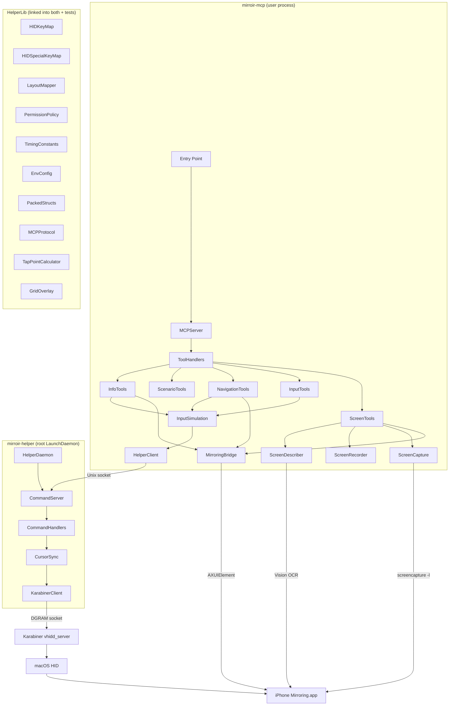

### Why Two Processes?

| Process | Runs As | System APIs Needed | Why |
|---------|---------|-------------------|-----|
| `mirroir-mcp` | Current user | AXUIElement (Accessibility), Vision (OCR), screencapture, NSWorkspace | Window discovery, screenshots, OCR, app activation — all user-level APIs |
| `mirroir-helper` | root | Karabiner DriverKit sockets, CGWarpMouseCursorPosition, CGAssociateMouseAndMouseCursorPosition | Karabiner's virtual HID device sockets live in a root-only directory; cursor warping requires CGEvent privileges |

`HelperLib` is a shared Swift library linked into both executables and all three test targets. It contains key mappings, permission logic, timing configuration, packed binary structs, and protocol types.

## 3. MCP Server Startup Flow

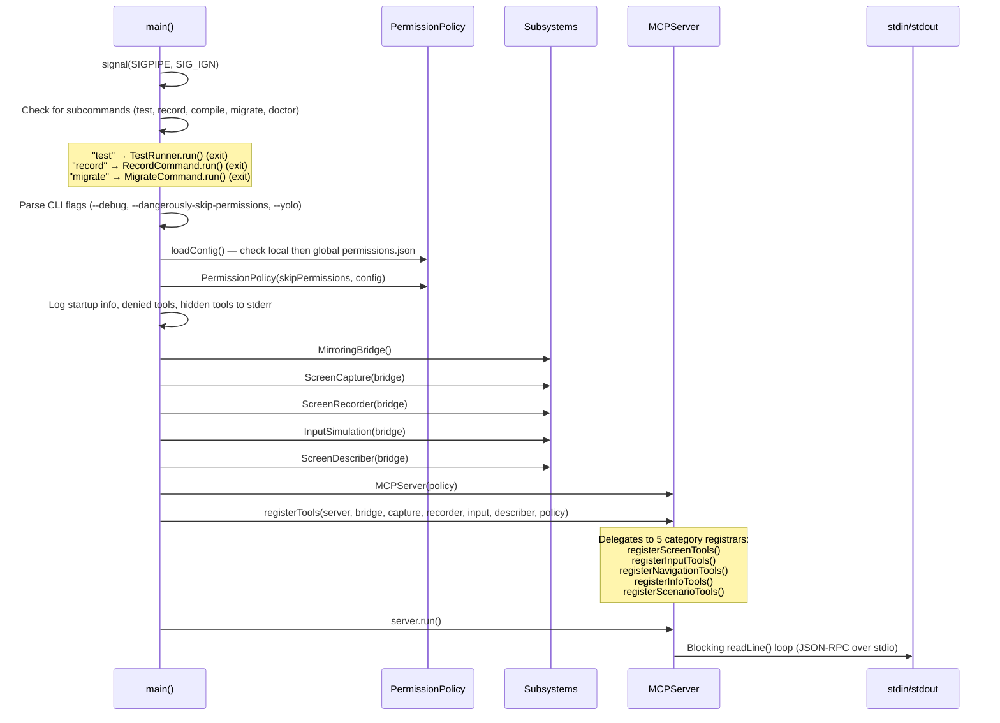

**Ref:** `Sources/mirroir-mcp/mirroir_mcp.swift`

## 4. JSON-RPC Protocol

The server implements JSON-RPC 2.0 over line-delimited stdin/stdout. Each line is one JSON object.

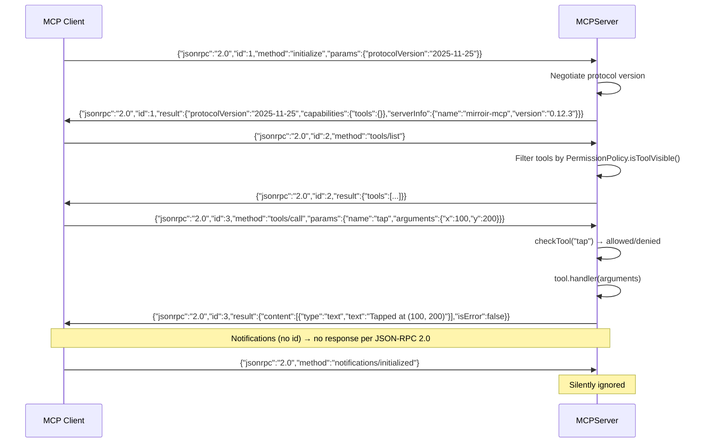

### Method Dispatch

| Method | Handler | Description |
|--------|---------|-------------|
| `initialize` | `handleInitialize` | Protocol version negotiation, server capabilities |
| `tools/list` | `handleToolsList` | Returns visible tools filtered by permission policy |
| `tools/call` | `handleToolsCall` | Permission check → tool handler dispatch |
| `ping` | inline | Returns empty result `{}` |
| _(other)_ | — | Error: `-32601 Method not found` |

### Protocol Versions

The server supports two MCP protocol versions, negotiating the client's preferred version when possible:

| Version | Status |
|---------|--------|
| `2025-11-25` | Primary (latest MCP spec) |
| `2024-11-05` | Fallback for older clients |

### Error Codes

| Code | Meaning | When |
|------|---------|------|
| `-32700` | Parse error | Invalid UTF-8 or malformed JSON |
| `-32601` | Method not found | Unknown JSON-RPC method |
| `-32602` | Invalid params | Missing tool name or unknown tool |
| `-32603` | Internal error | Response encoding failure |

**Ref:** `Sources/mirroir-mcp/MCPServer.swift`

## 5. Tool Registration Architecture

`ToolHandlers.swift` is the orchestrator. It delegates to 5 category-specific registrar functions, each in its own file:

| Registrar | File | Tools Registered |
|-----------|------|------------------|
| `registerScreenTools` | `ScreenTools.swift` | `screenshot`, `describe_screen`, `start_recording`, `stop_recording` |
| `registerInputTools` | `InputTools.swift` | `tap`, `swipe`, `drag`, `type_text`, `press_key`, `long_press`, `double_tap`, `shake` |
| `registerNavigationTools` | `NavigationTools.swift` | `launch_app`, `open_url`, `press_home`, `press_app_switcher`, `spotlight` |
| `registerInfoTools` | `InfoTools.swift` | `status`, `get_orientation`, `check_health` |
| `registerScenarioTools` | `ScenarioTools.swift` | `list_scenarios`, `get_scenario` |
| `registerScrollToTools` | `ScrollToTools.swift` | `scroll_to` |
| `registerAppManagementTools` | `AppManagementTools.swift` | `reset_app` |
| `registerMeasureTools` | `MeasureTools.swift` | `measure` |
| `registerNetworkTools` | `NetworkTools.swift` | `set_network` |

Each tool is defined as an `MCPToolDefinition` containing name, description, JSON Schema input definition, and a synchronous handler closure.

**Ref:** `Sources/mirroir-mcp/ToolHandlers.swift`, `*Tools.swift`

## 6. Protocol Abstractions (DI Layer)

Five protocols abstract system boundaries, enabling dependency injection for testing:

| Protocol | Methods | Real Implementation | Test Double |
|----------|---------|--------------------|----|
| `MirroringBridging` | `findProcess()`, `getWindowInfo()`, `getState()`, `getOrientation()`, `triggerMenuAction()`, `pressResume()` | `MirroringBridge` | `StubBridge` |
| `InputProviding` | `tap()`, `swipe()`, `drag()`, `longPress()`, `doubleTap()`, `shake()`, `typeText()`, `pressKey()`, `launchApp()`, `openURL()`, `helperStatus()`, `isHelperAvailable` | `InputSimulation` | `StubInput` |
| `ScreenCapturing` | `captureBase64()` | `ScreenCapture` | `StubCapture` |
| `ScreenRecording` | `startRecording()`, `stopRecording()` | `ScreenRecorder` | `StubRecorder` |
| `ScreenDescribing` | `describe()` | `ScreenDescriber` | `StubDescriber` |

All protocols require `Sendable` conformance. Real implementations conform via extensions in `Protocols.swift`.

**Ref:** `Sources/mirroir-mcp/Protocols.swift`, `Tests/MCPServerTests/TestDoubles.swift`

## 7. Subsystem Deep Dives

### 7a. MirroringBridge

Discovers and interacts with the iPhone Mirroring app via macOS Accessibility APIs.

**Window Discovery:**
- Finds the iPhone Mirroring process via `NSWorkspace.shared.runningApplications`
- Gets the main window using `kAXMainWindowAttribute` (not `kAXWindowsAttribute` — more reliable for single-window apps)
- Resolves `CGWindowID` by matching PID + window geometry against `CGWindowListCopyWindowInfo`

**State Detection:**
- Inspects the AX child count of the window's content view
- Maps child count patterns to `MirroringState` values (connected, paused, disconnected)

**Menu Bar Traversal:**
- Navigates `AXMenuBar` → `AXMenuBarItem` → `AXMenuItem` hierarchy
- Used by navigation tools to trigger Home, Spotlight, and App Switcher actions directly
- Does not require window focus — works even when another app is frontmost

**Key Types:** `WindowInfo` (position, size, windowID), `MirroringState` (connected/paused/disconnected), `DeviceOrientation` (portrait/landscape)

**Ref:** `Sources/mirroir-mcp/MirroringBridge.swift`

### 7b. InputSimulation

Bridges MCP tool calls to the helper daemon for touch and keyboard input.

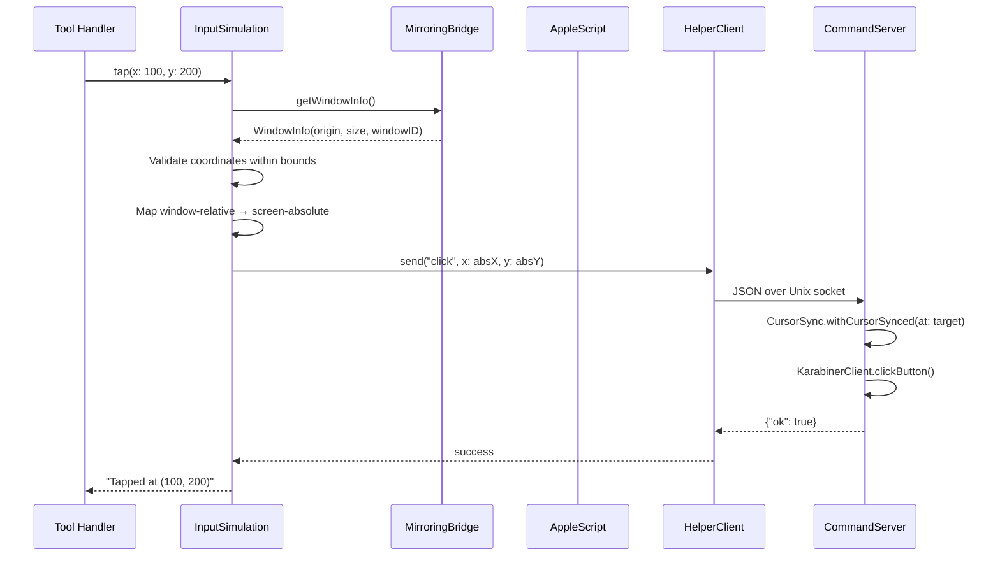

**Coordinate Mapping:**
- Tool parameters are window-relative (0,0 = top-left of mirroring content)
- `InputSimulation` adds the window origin to produce screen-absolute coordinates
- Validates that coordinates fall within the window bounds before sending

**Focus Management:**
- `ensureMirroringFrontmost()` activates iPhone Mirroring via AppleScript System Events
- AppleScript is the only reliable way to trigger a macOS Space switch
- Runs on every keyboard input call (stale `NSWorkspace.frontmostApplication` values)
- When already frontmost, activation is a no-op (~10ms, no settling delay)

**Layout Translation:**
- `LayoutMapper.buildSubstitution()` runs at init to detect non-US keyboard layouts
- Builds a character substitution table using `UCKeyTranslate`
- `buildTypeSegments()` splits text into HID-typeable vs skipped characters
- Skipped characters are reported back to the caller

**HID Chunking:**
- Text is sent in 15-character chunks (configurable via `MIRROIR_HID_TYPING_CHUNK_SIZE`)
- Each character becomes a `type` command to the helper daemon

**Ref:** `Sources/mirroir-mcp/InputSimulation.swift`

### 7c. ScreenCapture

Captures screenshots of the iPhone Mirroring window.

**Flow:**
1. Get `CGWindowID` from `MirroringBridge.getWindowInfo()`
2. Spawn `screencapture -l <windowID> -x <tempFile>` as a `Process`
3. Wait with timeout via `Process.waitWithTimeout(seconds:)` — prevents hanging on stuck connections
4. Read the PNG file, base64-encode it
5. Clean up temp file

**Ref:** `Sources/mirroir-mcp/ScreenCapture.swift`

### 7d. ScreenRecorder

Records video of the iPhone Mirroring window using a state machine.

**State Machine:**

```
idle ──start_recording──► recording
  ▲                          │
  └────stop_recording────────┘
```

- State protected by `OSAllocatedUnfairLock` for thread safety
- Spawns `screencapture -v -l <windowID> <outputPath>` for video capture
- Stops recording by sending `SIGINT` to the screencapture process (graceful termination)
- Early failure detection: waits 500ms after launch and checks if process is still running

**Ref:** `Sources/mirroir-mcp/ScreenRecorder.swift`

### 7e. ScreenDescriber (OCR Pipeline)

Extracts text elements and tap coordinates from the mirrored iPhone screen.

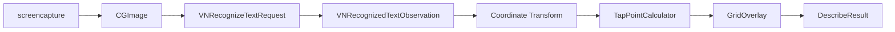

**Pipeline Steps:**
1. **Capture:** Screenshot via `ScreenCapture` → PNG data
2. **Image Load:** PNG → `CGImage` via `CGImageSourceCreateWithData`
3. **OCR:** `VNRecognizeTextRequest` extracts text observations with bounding boxes
4. **Coordinate Transform:** Vision coordinates (bottom-left origin, normalized) → window coordinates (top-left origin, points)
5. **TapPointCalculator:** Applies smart offset for icon labels (short text with large gap above → offset 30pt toward icon center)
6. **GridOverlay:** Draws 50pt coordinate grid on screenshot for AI reference
7. **Result:** Returns `DescribeResult` containing text list, annotated image (base64), and raw elements

**Ref:** `Sources/mirroir-mcp/ScreenDescriber.swift`, `Sources/HelperLib/TapPointCalculator.swift`, `Sources/HelperLib/GridOverlay.swift`

### 7f. HelperClient

Communicates with the root helper daemon over a Unix stream socket.

**Protocol:**
- Socket path: `/var/run/mirroir-helper.sock`
- Newline-delimited JSON (one command per line, one response per line)
- Maximum command size: 64KB

**Auto-reconnect:**
- Reconnects on send/receive failure
- Exposes `isAvailable` property for health checks

**Ref:** `Sources/mirroir-mcp/HelperClient.swift`

## 8. Helper Daemon Architecture

### 8a. Entry Point

```
main() → verify root → KarabinerClient.initialize()
       → install signal handlers (SIGTERM, SIGINT → stop)
       → CommandServer.start() (blocks)
```

- Verifies running as root (`getuid() == 0`)
- Initializes `KarabinerClient` — if Karabiner is unavailable, enters degraded mode (touch/keyboard commands fail gracefully, status reports `keyboard_ready: false`)
- Signal handlers call `CommandServer.stop()` for clean shutdown

**Ref:** `Sources/mirroir-helper/HelperDaemon.swift`

### 8b. CommandServer

Listens on a Unix stream socket for JSON commands from the MCP server.

| Property | Value |
|----------|-------|
| Socket path | `/var/run/mirroir-helper.sock` |
| Socket type | `SOCK_STREAM` (TCP-like, reliable) |
| Permissions | Mode `0660`, group: staff (gid 20) |
| Protocol | Newline-delimited JSON |
| Max command size | 65,536 bytes |
| Backlog | 4 connections |
| Concurrency | Single client at a time |

**Lifecycle:**
1. Unlink stale socket file
2. Create, bind, listen
3. Accept loop: `accept()` → `handleClient(fd:)` → close
4. Read loop: buffer `recv()` data → process complete lines → send response

**Response Format:**
- Success: `{"ok": true}` (or with additional fields like `skipped_characters`)
- Error: `{"ok": false, "error": "message"}`

**Ref:** `Sources/mirroir-helper/CommandServer.swift`

### 8c. CommandHandlers

Ten actions dispatched by `processCommand()`:

| Action | Parameters | Description |
|--------|-----------|-------------|
| `click` | `x`, `y` | Single tap via CursorSync + button press (80ms hold) |
| `long_press` | `x`, `y`, `duration_ms?` (default 500, min 100) | Extended tap via CursorSync + configurable hold |
| `double_tap` | `x`, `y` | Two rapid taps: 40ms hold + 50ms gap + 40ms hold |
| `drag` | `from_x`, `from_y`, `to_x`, `to_y`, `duration_ms?` (default 1000, min 200) | Button down → 150ms hold → 60-step interpolated movement → button up |
| `type` | `text`, `focus_x?`, `focus_y?` | HID keycode per character; optional atomic focus click |
| `swipe` | `from_x`, `from_y`, `to_x`, `to_y`, `duration_ms?` (default 300) | Scroll wheel events (20 steps, scaled by 8.0 divisor) |
| `press_key` | `key`, `modifiers?` | Special key or single char with modifier support |
| `move` | `dx`, `dy` (-128 to 127) | Relative mouse movement via Karabiner pointing device |
| `shake` | _(none)_ | Sends Ctrl+Cmd+Z (HID keycode 0x1D) |
| `status` | _(none)_ | Reports `keyboard_ready`, `pointing_ready`, connection state |

**Ref:** `Sources/mirroir-helper/CommandHandlers.swift`

### 8d. CursorSync Pattern

Every touch command (click, long_press, double_tap, drag) follows this sequence:

```
1. Save      → CGEvent.location (current cursor position)
2. Disconnect → CGAssociateMouseAndMouseCursorPosition(false)
                 Physical mouse stops controlling cursor
3. Warp      → CGWarpMouseCursorPosition(target)
                 Position cursor at target coordinates
4. Settle    → usleep(10ms)
                 Wait for macOS to register new position
5. Nudge     → Karabiner pointing: +1 right, sleep(5ms), -1 left, sleep(10ms)
                 Syncs virtual HID device with actual cursor position
6. Execute   → The actual input operation (click, drag, etc.)
7. Restore   → CGWarpMouseCursorPosition(savedPosition)
8. Reconnect → CGAssociateMouseAndMouseCursorPosition(true)
```

**Why CGWarp alone isn't enough:** `CGWarpMouseCursorPosition` only repositions the cursor — it does not generate macOS HID events. Karabiner's virtual pointing device tracks position via its own event stream. The nudge (+1 then -1) forces Karabiner to update its internal position to match the warped cursor, so subsequent button presses land at the correct coordinates.

**Why disconnect/reconnect:** Physical mouse movement during the warp-nudge-execute sequence would interfere with the target coordinates. Disconnecting the physical mouse ensures no competing input during the operation.

**Ref:** `Sources/mirroir-helper/CursorSync.swift`

### 8e. KarabinerClient Wire Protocol

Communicates with Karabiner's DriverKit virtual HID daemon via Unix datagram sockets.

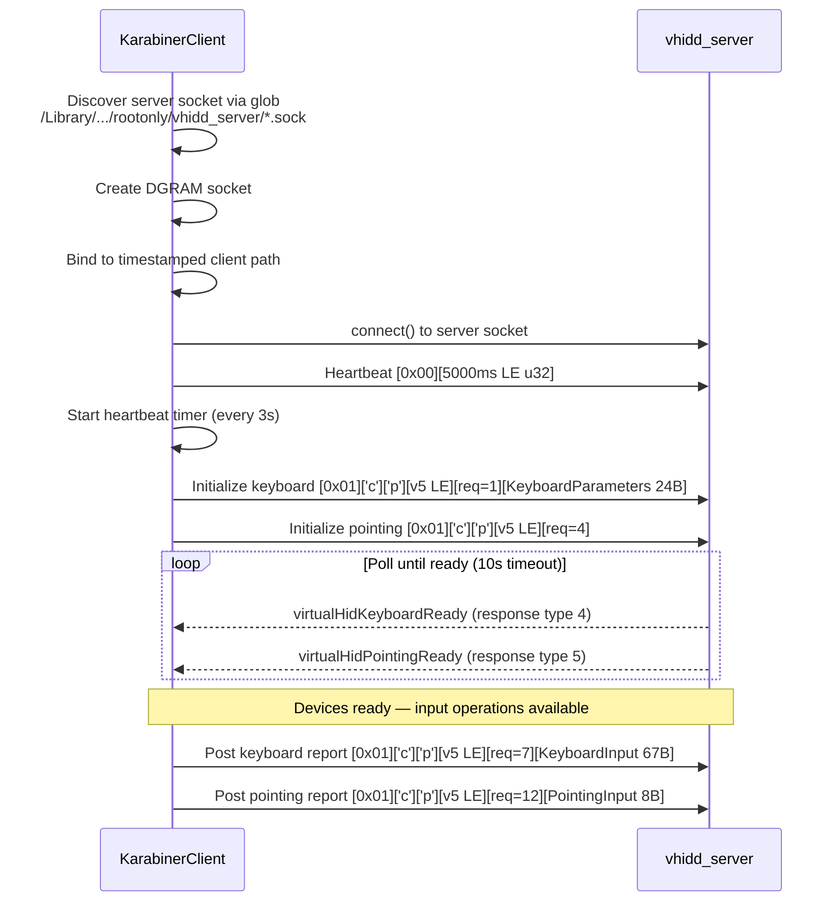

**Message Framing:**

| Type | Byte Format | Description |
|------|-------------|-------------|
| Heartbeat | `[0x00][deadline_ms: u32 LE]` | 5 bytes. Tells server "I'm alive until this deadline" |
| User Data | `[0x01]['c'][p'][version: u16 LE][request_type: u8][payload...]` | 6+ bytes. Protocol version 5 |

**Binary Structs:**

| Struct | Size | Key Fields |
|--------|------|------------|
| `KeyboardParameters` | 24 bytes | `vendorID` (0x05ac = Apple), `productID` (0x0250), `countryCode` (1 = ISO) |
| `KeyboardInput` | 67 bytes | `reportID` (1), `modifiers` (u8 bitmask), `reserved`, 32 key slots (u16 each) |
| `PointingInput` | 8 bytes | `buttons` (u32), `x` (i8), `y` (i8), `verticalWheel` (i8), `horizontalWheel` (i8) |
| `KeyboardModifier` | 1 byte | OptionSet bitmask: leftControl=0x01, leftShift=0x02, leftOption=0x04, leftCommand=0x08, right variants=0x10-0x80 |

**Request Types:**

| Value | Name | Payload |
|-------|------|---------|
| 1 | virtualHidKeyboardInitialize | `KeyboardParameters` (24B) |
| 2 | virtualHidKeyboardTerminate | _(none)_ |
| 3 | virtualHidKeyboardReset | _(none)_ |
| 4 | virtualHidPointingInitialize | _(none)_ |
| 5 | virtualHidPointingTerminate | _(none)_ |
| 6 | virtualHidPointingReset | _(none)_ |
| 7 | postKeyboardInputReport | `KeyboardInput` (67B) |
| 8 | postConsumerInputReport | _(unused)_ |
| 9 | postAppleVendorKeyboardInputReport | _(unused)_ |
| 10 | postAppleVendorTopCaseInputReport | _(unused)_ |
| 11 | postGenericDesktopInputReport | _(unused)_ |
| 12 | postPointingInputReport | `PointingInput` (8B) |

**Response Types:**

| Value | Name | Effect |
|-------|------|--------|
| 1 | driverActivated | _(informational)_ |
| 2 | driverConnected | _(informational)_ |
| 3 | driverVersionMismatched | _(warning)_ |
| 4 | virtualHidKeyboardReady | Sets `isKeyboardReady = true` |
| 5 | virtualHidPointingReady | Sets `isPointingReady = true` |

**Server Monitoring:** A periodic timer (every 3s) checks if the server socket still exists. If the Karabiner daemon restarts, the client detects the socket disappearance and marks itself as disconnected.

**Ref:** `Sources/mirroir-helper/KarabinerClient.swift`, `Sources/HelperLib/PackedStructs.swift`

## 9. HelperLib Shared Components

### HID Key Mapping

Three layers of key resolution:

| Component | Purpose | Ref |
|-----------|---------|-----|
| `HIDKeyMap` | Maps characters (a-z, 0-9, punctuation, symbols) to USB HID keycodes + modifiers. US QWERTY reference layout. O(1) dictionary lookup. | `Sources/HelperLib/HIDKeyMap.swift` |
| `HIDSpecialKeyMap` | Maps named keys (return, escape, tab, delete, space, arrows) to HID keycodes. Also maps modifier names to `KeyboardModifier` bitmask. | `Sources/HelperLib/HIDSpecialKeyMap.swift` |
| `LayoutMapper` | Detects non-US keyboard layouts via `UCKeyTranslate` and builds character substitution tables. Handles ISO key swap (HID 0x64 ↔ 0x35) for non-US layouts. | `Sources/HelperLib/LayoutMapper.swift` |

### Permission Engine

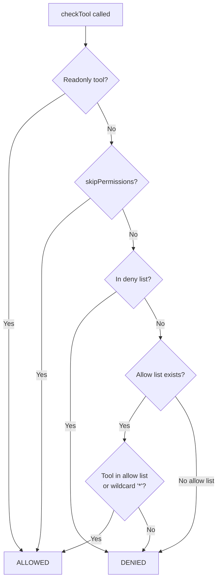

**Resolution order:** readonly → skip → deny → allow → fail-closed

**Readonly tools** (always allowed): `screenshot`, `describe_screen`, `start_recording`, `stop_recording`, `get_orientation`, `status`, `list_scenarios`, `get_scenario`

**Mutating tools** (require permission): `tap`, `swipe`, `drag`, `type_text`, `press_key`, `long_press`, `double_tap`, `shake`, `launch_app`, `open_url`, `press_home`, `press_app_switcher`, `spotlight`, `scroll_to`, `reset_app`, `measure`, `set_network`

**Config loading:** Project-local (`./.mirroir-mcp/permissions.json`) takes priority over global (`~/.mirroir-mcp/permissions.json`). Malformed config → `nil` → fail-closed.

**Ref:** `Sources/HelperLib/PermissionPolicy.swift`

### Configuration

| Component | Purpose |
|-----------|---------|
| `TimingConstants` | Named constants for all timing delays (microseconds) and non-timing magic numbers. Compile-time defaults. |
| `EnvConfig` | Reads `settings.json` first (project-local, then global), then `MIRROIR_<SCREAMING_SNAKE_CASE>` environment variables, falling back to `TimingConstants` defaults. |

Resolution order per key: `<cwd>/.mirroir-mcp/settings.json` → `~/.mirroir-mcp/settings.json` → env var → `TimingConstants` default. See [Configuration](../README.md#configuration) in the README.

**Ref:** `Sources/HelperLib/TimingConstants.swift`, `Sources/HelperLib/EnvConfig.swift`

### OCR Utilities

| Component | Purpose |
|-----------|---------|
| `TapPointCalculator` | Computes tap coordinates from raw OCR bounding boxes. For short labels (≤15 chars) with large gap above (>50pt), offsets 30pt upward toward associated icon center. |
| `GridOverlay` | Draws 50pt coordinate grid on screenshot PNG with labeled axes. Semi-transparent lines with pill-shaped labels for readability. |

**Ref:** `Sources/HelperLib/TapPointCalculator.swift`, `Sources/HelperLib/GridOverlay.swift`

### Protocol Types

All JSON-RPC and MCP types live in `MCPProtocol.swift`:

| Type | Purpose |
|------|---------|
| `JSONValue` | Recursive enum: `.string`, `.number`, `.bool`, `.object`, `.array`, `.null`. Codable + Sendable. |
| `JSONRPCRequest` | Incoming request: `jsonrpc`, `id` (string or int), `method`, `params` |
| `JSONRPCResponse` | Outgoing response: `jsonrpc`, `id`, `result` or `error` |
| `JSONRPCError` | Error with `code` and `message` |
| `MCPToolDefinition` | Tool registration: name, description, JSON Schema, handler closure |
| `MCPToolResult` | Handler return: content array (text or image) + isError flag |
| `MCPContent` | Content item: `.text(String)` or `.image(base64, mimeType)` |
| `RequestID` | Enum: `.string(String)` or `.number(Int)` |

**Ref:** `Sources/HelperLib/MCPProtocol.swift`

## 10. Input Paths Summary

### Path 1: Touch (tap, long_press, double_tap)


### Path 2: Keyboard (type_text, press_key)

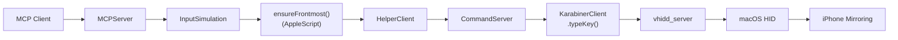

### Path 3: Navigation (press_home, press_app_switcher, spotlight)

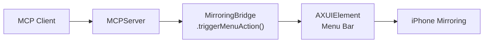

### Path 4: Composite (launch_app, open_url)

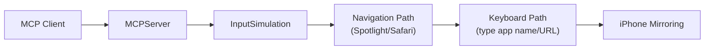

### Path 5: Observation (screenshot, describe_screen, status, get_orientation)

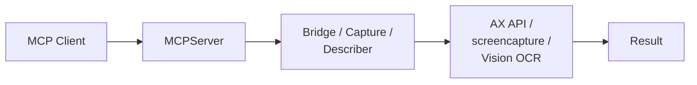

No helper daemon involvement — all observation is done in the user process.

## 11. Swipe vs Drag

A critical distinction in iPhone Mirroring's input model:

| | Swipe | Drag |
|---|---|---|
| **macOS Input** | Scroll wheel events | Click-drag (button held + movement) |
| **iOS Gesture** | Scroll / page swipe | Touch-and-drag (icon rearranging, sliders) |
| **Implementation** | `PointingInput.verticalWheel` / `horizontalWheel` | `PointingInput.buttons = 0x01` + interpolated `x`/`y` movement |
| **Steps** | 20 interpolation steps | 60 interpolation steps |
| **Duration** | Default 300ms | Default 1000ms (min 200ms) |
| **Pixel Scaling** | Divided by 8.0 (pixels → scroll ticks) | Direct coordinate interpolation |

**Getting them confused causes:** Swipe where drag is intended → page scrolls instead of icon rearranging. Drag where swipe is intended → enters icon jiggle mode instead of scrolling.

## 12. Pluggable Target Architecture

The MCP server does not hardcode which app it controls. Two environment variables determine the target:

| Variable | Default | Purpose |
|----------|---------|---------|
| `MIRROIR_BUNDLE_ID` | `com.apple.ScreenContinuity` | Bundle identifier for process discovery via `NSWorkspace` |
| `MIRROIR_PROCESS_NAME` | `iPhone Mirroring` | Display name (used in user-facing messages) |

These are read via `EnvConfig` (the same mechanism used for all runtime configuration) and consumed by `MirroringBridge.findProcess()` at the point of use — no caching, no initialization ceremony.

### Why This Matters

Every subsystem that interacts with the target app flows through `MirroringBridge`:

```
MirroringBridge.findProcess()          ← uses EnvConfig.mirroringBundleID
    │
    ├── getWindowInfo()                ← AXUIElement + CGWindowList
    ├── getState()                     ← AX child inspection
    ├── getOrientation()               ← window dimensions
    ├── triggerMenuAction()            ← AX menu bar traversal
    │
    └── used by:
        ├── ScreenCapture              ← screencapture -l <windowID>
        ├── ScreenDescriber            ← Vision OCR on captured image
        └── InputSimulation            ← coordinate mapping from window origin
```

Changing the bundle ID switches the entire system to target a different app. No code paths diverge, no feature flags, no conditional compilation.

### FakeMirroring: The CI Test Target

`FakeMirroring` (`com.jfarcand.FakeMirroring`) is a 100-line macOS app that provides the same API surface as iPhone Mirroring:

- **410×898pt window** matching iPhone Mirroring's portrait dimensions
- **AX-accessible main window** discoverable via `kAXMainWindowAttribute`
- **View menu** with Home Screen / Spotlight / App Switcher items for AX traversal tests
- **Text labels** rendered at 18pt on dark background for Vision OCR validation

It is built as an SPM executable target, packaged into a `.app` bundle by `scripts/package-fake-app.sh`, and used exclusively in CI. The production binary has no knowledge of FakeMirroring — it simply targets whatever `MIRROIR_BUNDLE_ID` resolves to.

**Ref:** `Sources/FakeMirroring/main.swift`, `docs/testing.md`

## 13. CLI Subcommands

The `mirroir-mcp` binary doubles as the `mirroir` CLI (via symlink). Subcommands are dispatched in `main()` before MCP server initialization — they create their own subsystem instances and exit directly.

### `mirroir migrate` — YAML to SKILL.md Converter

Converts YAML scenario files to SKILL.md format. SKILL.md uses YAML front matter for metadata and a markdown body with natural-language steps — the format AI agents natively understand.

```
main() → MigrateCommand.run(arguments)
         │
         ├── Parse YAML header (name, app, description, tags, etc.)
         ├── Generate YAML front matter (--- delimited)
         ├── Convert steps to numbered markdown prose
         └── Write .md file alongside the .yaml source
```

| Flag | Description |
|------|-------------|
| `--dry-run` | Preview converted output without writing files |
| `--output-dir <path>` | Write `.md` files to a different directory |
| `--dir <path>` | Convert all YAML files in a directory recursively |

**Ref:** `Sources/mirroir-mcp/MigrateCommand.swift`

### `mirroir test` — Deterministic Scenario Runner

Executes scenario files (YAML or SKILL.md) without AI in the loop. Steps run sequentially: OCR finds elements, taps land on coordinates, assertions pass or fail.

```
main() → TestRunner.run(arguments)
         │
         ├── ScenarioParser.parse()     ← YAML → [ScenarioStep]
         ├── StepExecutor.execute()     ← step → subsystem calls
         │   ├── ElementMatcher.find()  ← fuzzy OCR text matching
         │   ├── InputProviding.tap()   ← via real subsystems
         │   └── ScreenDescribing       ← OCR for assertions
         ├── ConsoleReporter            ← terminal output
         └── JUnitReporter              ← XML for CI
```

| Component | File | Purpose |
|-----------|------|---------|
| `TestRunner` | `TestRunner.swift` | CLI arg parsing, scenario resolution, orchestration |
| `ScenarioParser` | `ScenarioParser.swift` | YAML → `ScenarioDefinition` with `[ScenarioStep]` |
| `SkillMdParser` | `SkillMdParser.swift` | SKILL.md front matter parsing (name, app, tags, etc.) |
| `MigrateCommand` | `MigrateCommand.swift` | YAML → SKILL.md conversion engine |
| `StepExecutor` | `StepExecutor.swift` | Runs each step against real subsystems |
| `ElementMatcher` | `ElementMatcher.swift` | Fuzzy OCR text matching (exact → case-insensitive → substring) |
| `ConsoleReporter` | `ConsoleReporter.swift` | Per-step/per-scenario terminal formatting |
| `JUnitReporter` | `JUnitReporter.swift` | JUnit XML generation for CI integration |
| `AgentDiagnostic` | `AgentDiagnostic.swift` | Deterministic OCR-based failure diagnosis + AI payload builder |
| `AIAgentRegistry` | `AIAgentProvider.swift` | Agent config model, built-in registry, YAML profile loader, resolver |
| `AnthropicProvider` | `AnthropicProvider.swift` | Anthropic Messages API client |
| `OpenAIProvider` | `OpenAIProvider.swift` | OpenAI Chat Completions API client |
| `OllamaProvider` | `OllamaProvider.swift` | Local Ollama API client |
| `CommandProvider` | `CommandProvider.swift` | Local CLI agent via Process stdin/stdout |

### `mirroir record` — Interaction Recorder

Captures live user interactions with iPhone Mirroring as scenario YAML via a passive CGEvent tap.

```
main() → RecordCommand.run(arguments)
         │
         ├── EventRecorder.start()       ← passive CGEvent tap
         │   ├── mouseDown → OCR cache   ← label lookup before screen changes
         │   ├── mouseUp → classify      ← tap vs swipe vs long_press
         │   └── keyDown → buffer        ← group into type/press_key steps
         ├── (Ctrl+C) → EventRecorder.stop()
         └── YAMLGenerator.generate()    ← events → scenario YAML file
```

| Component | File | Purpose |
|-----------|------|---------|
| `RecordCommand` | `RecordCommand.swift` | CLI arg parsing, signal handling, output |
| `EventRecorder` | `EventRecorder.swift` | CGEvent tap setup, mouse/key event handling |
| `EventClassifier` | `EventRecorder.swift` | Pure classification logic (distance/duration thresholds) |
| `YAMLGenerator` | `YAMLGenerator.swift` | Converts `[RecordedEvent]` → scenario YAML |
